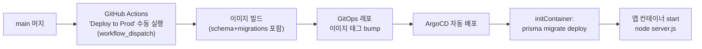

@AGENTS.md

## 디자인 작업 규칙

!IMPORTANT: **UI·디자인·스타일 관련 작업(컴포넌트 스타일, 색상, 타이포그래피, 여백, 레이아웃, 테마 등)을 할 때는 반드시 프로젝트 루트의 [`DESIGN.md`](./DESIGN.md)를 먼저 참고**하고 그 디자인 시스템에 맞춰 구현한다.

- **디자인 시스템**: Vercel 계열 **near-white 라이트 전용** 테마. canvas-soft 캔버스(`#fafafa`) + 순수 흰색 카드(`#ffffff`) + 인셋 면(`#f5f5f5`) + hairline 보더(`#ebebeb`) + ink 텍스트/primary(`#171717`) + 링크 블루(`#0070f3`). (구 Linear 다크 테마에서 이관됨.)
- **토큰 소스**: 색상·타이포·radius·spacing 값은 `DESIGN.md`의 front matter(`colors`/`typography`/`rounded`/`spacing`)와 `components:` 정의를 정본으로 삼는다. 임의로 새 색을 만들지 말 것.
- **적용 위치**: 전역 토큰은 `src/app/globals.css`의 CSS 변수(shadcn/Base UI 시맨틱 토큰 `--background`/`--card`/`--primary`/`--border` 등)에 매핑돼 있다. 색을 바꿀 땐 하드코딩 대신 이 변수를 통해 반영한다. 토큰↔코드 매핑 상세는 [`docs/design-system.md`](./docs/design-system.md).
- **핵심 원칙**(DESIGN.md Do/Don't 요약):
  - 잉크(`#171717`)가 **단일 primary/CTA**. 링크 블루(`#0070f3`)는 인라인 링크 강조에만 희소하게.
  - 깊이는 그림자가 아니라 **surface ladder(#fafafa→#ffffff→#f5f5f5) + inset hairline ring**으로 표현. 무거운 단일 drop-shadow 금지.
  - 여섯 번째 채도 높은 액센트를 새로 도입하지 않는다. (상태/우선순위 태그 색은 in-product 예외)
  - 카드는 `rounded.lg`(8px), 버튼/인풋은 작은 반경(5–6px). round 는 살짝만 준다(과거 12px 카드에서 축소). 마케팅 100px pill CTA 형태는 in-product 화면에 쓰지 않는다.
  - 라이트 전용(다크 모드는 만들지 않는다). `<html>`에 `.dark` 클래스를 붙이지 않는다.

## 프로젝트 문서(docs) 라우팅

작업 맥락이 필요하면 코드를 뒤지기 전에 [`docs/`](./docs/) 를 먼저 참고한다. 인덱스: [`docs/README.md`](./docs/README.md).

- **디자인 시스템 구현**(토큰 매핑·테마·`ItemRow` 등 공용 패턴): [`docs/design-system.md`](./docs/design-system.md)
- **엔지니어링 함정/주의사항**(아래 필독 섹션의 상세): [`docs/gotchas.md`](./docs/gotchas.md)
- **변경 이력**(무엇을·왜 바꿨나): [`docs/work-log.md`](./docs/work-log.md)
- **예정/백로그 작업**(스코핑·열린 질문): [`docs/roadmap-v2.md`](./docs/roadmap-v2.md) — 현행 백로그. Phase 1~4 이력은 [`docs/roadmap.md`](./docs/roadmap.md)

새 문서를 추가하면 `docs/README.md` 인덱스와 이 라우팅 목록도 함께 갱신한다.

## 엔지니어링 주의사항 (필독 — 실제로 물렸던 함정)

상세·전체 목록은 [`docs/gotchas.md`](./docs/gotchas.md). 반복적으로 물린 핵심만:

- **스키마 변경 후 dev 서버 재시작 필수.** `next dev`는 옛 Prisma client를 메모리에 물고 있어, `migrate`+`generate` 후에도 재시작 전엔 `prisma.<model>` undefined 런타임 에러. **"DB 연결 오류"로 오인 금지** — 재시작으로 해결.
- **병합 후 `npx prisma generate`.** 스키마 브랜치 병합 시 client 자동 재생성 안 됨 → `Property 'X' does not exist on PrismaClient` 타입 에러.
- **폼은 미선택/빈 값에 `null`을 보낸다.** zod optional 필드는 `.optional()`(=undefined만) 말고 **`.nullish()`** 로 — 안 그러면 create/update 전부 ZodError로 저장 실패.
- **git worktree + Turbopack**: worktree의 symlink node_modules는 `next build`/`dev`가 거부. worktree 검증은 **`tsc --noEmit`+`eslint`만**, 통합 빌드는 병합 후 main에서. worktree에서 추가한 npm 의존성은 물리설치 누락되니 병합 후 main에서 `npm install`.
- **엔티티 드롭다운은 `OptionSelect`**(`src/components/selects/option-select.tsx`) 사용 — Base UI `SelectValue`는 render 함수 없으면 원시 id/enum을 노출한다.
- **`Card` 여백**: 기본 `py`+`gap`이 있으므로 `CardContent`에 py 중복 금지(`py-0`), `divide-y` 리스트는 `gap-0` override. (여백 버그 단골)
- **`.worktrees/` 는 eslint에서 ignore됨**(`eslint.config.mjs` `globalIgnores`, B6). 병렬 worktree 사본이 더 이상 lint 결과를 부풀리지 않는다. (과거엔 경로 필터가 필요했음.)
- **병렬 서브에이전트 산출물은 병합 전 NUL/비-UTF8 스캔.** 에이전트가 sentinel 등으로 NUL(`"\x00"`)을 코드에 박으면 tsc/eslint는 통과하지만 git이 파일을 **바이너리로 인식**(`git diff --stat`에 `Bin ...`) → 실제로 물렸음. [gotchas §9](./docs/gotchas.md).
- **위키 페이지 조회엔 항상 `where: { deletedAt: null }`**(soft-delete 휴지통 유출 방지). 전역 검색(`globalSearch`)·목록·트리 모두 해당. [gotchas §8].
- **공유 목록/옵션/트리 쿼리는 `unstable_cache` 로 감싸지 않는다(2026-07-13 제거).** 과거 `queries.ts` 14개를 `src/lib/cache.ts` 태그로 캐시하고 `bumpTags`(=`updateTag`)로 무효화했으나, **prod 는 `replicas: 2` 인데 공유 `cacheHandler` 가 없어** `unstable_cache` 가 **pod 별 로컬 캐시**였다 → mutation 이 처리된 pod 만 무효화되고 이어지는 `router.refresh()` 가 다른 pod 로 가면 stale(위키 저장 후 좌측 사이드바 제목이 간헐적으로 안 바뀌던 버그의 근본원인). dev·단일 인스턴스에선 재현 안 됨. **해결: 캐시 레이어 자체를 제거** — 이제 공유 쿼리는 매 렌더 DB 직접 조회(공유 DB라 항상 fresh, 20인 규모 부하 무시가능). `revalidatePath`/`router.refresh()` 만으로 read-your-own-writes 보장(force-dynamic + 클라이언트 라우터 캐시 staleTime 0). **재도입 금지**: 멀티 replica 인 채로 `unstable_cache` 를 다시 쓰려면 반드시 Redis 등 공유 `cacheHandler` 를 함께 설정. [gotchas §13].
- **뷰포트에 고정(`fixed`)되는 팝업은 `max-height` + `overflow` 가 필수.** 없으면 내용이 길 때 화면 밖으로 잘리고 `fixed` 라 페이지 스크롤로도 닿을 수 없다(모바일에서 생성 다이얼로그의 저장 버튼에 접근 불가했던 버그의 근본원인). **중앙 정렬이 아니라 오프셋 배치(`top-[15vh]` 등)라면 상한도 오프셋을 뺀 값**이어야 한다(`max-h-[calc(85dvh-1rem)]`). 높이 단위는 `vh` 가 아니라 **`dvh`**(모바일 주소창). `overflow` 는 y 를 hidden 으로 막지 말 것 — 짧은 뷰포트에서 내용에 닿을 수 없어진다. 공용 프리미티브 기본값에 **축별 유틸(`overflow-y-*`)을 넣으면 이를 shorthand(`overflow-hidden`)로 덮던 소비자가 조용히 깨진다** — tailwind-merge 는 두 그룹을 별개로 본다. [gotchas §35].

## 테스트

- **Vitest 유닛 테스트 존재**: `npm run test`(= `vitest run`). 대상은 순수 로직 모듈(`src/lib/*.test.ts` — validators·rich-content·constants·activity-format). `keys.ts`의 DB 바운드 함수(`nextTeamNumber`)는 미커버(순수 `formatIssueKey`만). **코드 수정 시 관련 테스트 실행·추가**. (Playwright 스모크는 아직 없음 — 후속.)

### 반응형·CSS 변경 검증법 (로그인 게이트 우회)

로그인이 **Google OAuth 전용**이라 에이전트가 앱 화면을 직접 열 수 없다. `tsc`/`eslint`/`vitest` 는 CSS 레이아웃 버그를 전혀 못 잡으므로, 레이아웃 변경은 **dev 서버의 컴파일된 실제 CSS 로 구조를 복제해 `getBoundingClientRect` 로 실측**한다(로그인 페이지에서 DOM 주입). 아래 3가지는 **실제로 물려서 잘못된 결론을 냈던** 것들 — 반드시 지킬 것. [gotchas §35]

1. **주입한 클래스가 실제로 생성됐는지 `getComputedStyle` 로 먼저 확인.** Tailwind JIT 는 **소스에 없는 클래스의 CSS 를 만들지 않는다** → 주입해도 조용히 무시된다. 증상: 측정값이 뷰포트를 바꿔도 전부 동일. 소스에 넣기 전 값을 시험하려면 클래스 대신 **인라인 스타일**로.
2. **`cn()` 병합 결과 문자열로 테스트한다.** base + override 를 그냥 이어 붙이면 둘 다 DOM 에 남아 **클래스 순서가 아니라 스타일시트 순서**가 이겨 실제와 다른 결과가 나온다. 병합 결과는 프로젝트 루트에서 `twMerge(BASE, OVERRIDE)` 를 돌려 확인(레포 밖 `/tmp` 에선 `tailwind-merge` 해석 실패).
3. **모바일 폭 테스트는 창 리사이즈가 아니라 iframe 으로.** 이 환경에선 브라우저 창 리사이즈가 `innerWidth` 에 반영되지 않는다. **390px 폭 `<iframe src="/login">`** 을 띄우면 미디어쿼리가 iframe 뷰포트 기준으로 평가돼 `sm:` 브레이크포인트가 실제 모바일처럼 동작한다(`matchMedia('(min-width:640px)').matches === false` 로 확인). 높이를 바꿔가며(844/386/300) 재면 가로모드·짧은 뷰포트 회귀까지 잡힌다.

한계: 실제 앱의 상호작용(드롭다운 위치, 포커스, 애니메이션)은 이 방법으로 검증되지 않는다. **CSS 클래스만 바꾼 경우에 한해 복제 검증으로 갈음하고, 그 사실과 미확인 항목을 PR 에 명시**한다.

## 배포 / DB 마이그레이션 (k8s + GitOps)

!IMPORTANT: **Prisma 마이그레이션은 수동으로 적용하지 않는다.** 배포 시 k8s **initContainer** 가 앱 컨테이너(`node server.js`) 시작 전에 `prisma migrate deploy` 를 자동 실행한다. 따라서 스키마 변경 PR 을 main 에 머지한 뒤 로컬/운영에서 `migrate deploy` 를 **직접 칠 필요가 없다**(그래서 지금껏 이 명령을 친 적이 없다).

- **이미지 구성**(`Dockerfile`): 런타임 이미지에 `prisma/`(schema + migrations) + **전체** `node_modules`(prisma client·engine·CLI)를 복사한다 — initContainer 의 `prisma migrate deploy` 가 이미지 안에서 돌 수 있도록. (Prisma 6.x CLI 는 `@prisma/config` + hoisted 형제 deps(`effect`/`c12` 등)를 필요로 해서 `@prisma/*` 만 cherry-pick 하면 `Cannot find module 'effect'`. `Dockerfile` 44–57줄 주석 참조.)
- **initContainer 정의 위치**: 앱 레포가 아니라 **GitOps 레포 `Team-Neki-GitOps` 의 `overlays/prod/sprint-deployment.yaml`**(이 레포에선 안 보임). 배포 워크플로우가 initContainer + 앱 컨테이너 두 image 줄을 모두 같은 `sprint-prod:<sha>` 로 bump 한다.
- **배포는 자동이 아니라 수동 트리거**: `.github/workflows/deploy-prod.yml` 은 `workflow_dispatch` 전용 — **main 머지만으로는 배포되지 않는다.** GitHub Actions 탭에서 "Deploy to Prod" 를 수동 실행해야 한다.

- **함의**: 스키마를 바꾸면 마이그레이션 SQL(`prisma/migrations/<타임스탬프>_<이름>/migration.sql`)을 **반드시 커밋에 포함**한다(initContainer 가 이 파일들을 적용). additive 마이그레이션은 무중단. `package.json` 의 `db:deploy`(=`prisma migrate deploy`)·`db:migrate`(dev)·`db:push` 는 **로컬 개발용**이다. 병합 후 로컬 타입체크를 위한 `npx prisma generate` 는 여전히 필요([gotchas §1]) — 이는 배포와 별개인 로컬 client 재생성일 뿐이다.

## in-product 공용 기능(참고)

- **전역 검색/⌘K**: `command-palette.tsx`(토픽바 마운트, `queries.globalSearch` + `globalSearchAction`). 새 엔티티 추가 시 검색 그룹에 반영 고려.
- **라벨**: `Label` 스키마를 태스크에 표면화(`/labels` 관리, 부여 팝오버, `?label=` 필터, 색 뱃지). 에픽·프로젝트 라벨 부여는 스키마만 있고 UI 미구현(후속).
- **위키 리치 렌더링**: `wikiExtensions()`(에디터·뷰 공유)에 표(`TableKit`+`TableControls`+`table-cells.ts` 배경색 셀)·구문강조 코드(`CodeBlockLowlight`)·mermaid(`MermaidBlock` atom NodeView, 지연 로드)·글자색/배경색(`TextStyle`+`Color`+`BackgroundColor`)·정렬(`TextAlign`, heading/paragraph)·슬래시 커맨드(`SlashCommand`) 포함. 확장은 이 한 곳에만 추가. tiptap 은 **전 패키지 lockstep**(3.28) — 부분 업그레이드는 peer 정확핀 때문에 ERESOLVE. 함정은 [gotchas §18].
  - **이미지**(`image-view.tsx` NodeView + `image-utils.ts`): 편집 모드 선택 시 좌우 드래그 핸들 리사이즈(px, `attrs.width`, 최소 80px)·정렬 3버튼(`attrs.align`, 블록 정렬)·ALT 인라인 입력, 뷰 모드 더블클릭 라이트박스(원본 열기/다운로드). 노드 이름 `image` 유지(기존 문서 호환), width 는 `` 로 직렬화. width 커밋은 pointerup 1회(undo 1스텝).
  - **생성 모드/초안**: UI '새 페이지'는 `WikiPage.isDraft=true` 로 생성 → `/wiki/{id}?edit=1`(편집 모드+제목 포커스, Enter/↓ 본문 이동). 첫 저장 시 정식 전환. 초안은 **작성자에게만** 노출(트리 흐림+[초안], 검색/링크검색 제외, 타인 URL `notFound`), 초안 하위 페이지 생성 불가. MCP/API 생성은 초안 아님.
  - **색상/정렬 팔레트**: 정본은 `colors.ts`(`TEXT_COLORS` 10·`BG_COLORS` 9·`CELL_COLORS`) — 툴바/버블/표 메뉴가 공유, 새 색은 여기에만. 정렬은 툴바 팝오버+버블 3버튼.
  - **줄(블록) 핸들**(`block-handle.tsx`): `@tiptap/extension-drag-handle-react`. 클릭=블록 NodeSelection+복제/삭제 메뉴, 드래그=이동. WikiEditor 전용(뷰에는 없음).
  - **표 배경색/선택**: 셀 배경 attr 은 `table-cells.ts`(TableKit 의 tableCell/tableHeader 는 꺼서 교체). 셀 배경=우클릭 메뉴, 헤더 일괄=표 팝오버(`setHeaderRowBackground`), 열/행 선택=상단/좌측 hover 스트립(`selectColumn`/`selectRow`).
  - **슬래시 커맨드(/)**: `slash-command.ts`(`@tiptap/suggestion` 기반 Extension) + `slash-menu.tsx`(목록/필터). 제목1~6·글머리/번호/체크 목록·인용·코드·표·mermaid·구분선. 커맨드 추가는 `SLASH_ITEMS`(slash-menu) 한 곳에. 코드블록 내부·단어 중간 `/` 는 트리거 제외(`allow`).
  - **제목/툴바**: heading `levels:[1..6]`(`#` 개수만큼 h1~h6). 편집 툴바엔 H1/H2/H3·목록/체크 아이콘 없음 — 제목·목록은 `#`/`-`/`1.`/`[ ]` 또는 슬래시로. 툴바 아이콘 툴팁은 Base UI `Tooltip`(≈150ms), 네이티브 `title` 아님.
  - **저장/취소는 에디터가 아니라 헤더에**: `WikiEditor` 는 `forwardRef`+`useImperativeHandle({commit,cancel})`+`onStateChange`. `WikiDetail` 의 sticky 헤더(`...` 메뉴 좌측)에서 호출 — 긴 본문 스크롤에도 고정.
  - **코드블록**(`code-block.tsx` NodeView + `code-block-pairs.ts`): 우측 상단 복사 버튼·언어 select(Plain/Kotlin/Java/JSON/YAML/iOS-Swift, lowlight `common`), 괄호·따옴표 자동 닫기, Enter 자동 들여쓰기(`{`·`[` +1단, 그 외 유지). 코드블록 안 `#`/`@`/`/` 는 트리거 안 됨(Suggestion `allow`). `extend` 시 `this.parent` 로 lowlight·베이스 단축키 보존 필수. 강조 색은 `globals.css` `.hljs-*`. [gotchas §27]
  - **표 편집**: 삽입 버튼은 hover 크기 그리드 픽커(최대 8×8). 표 안이면 우측/하단 hover 스트립 `+` — 클릭/드래그 추가는 **항상 마지막 행/열 뒤**(`table-edit.ts` `appendRowEnd`/`appendColumnEnd`), **반대 방향 드래그로 삭제**(빈 행/열까지만). 셀 **우클릭 컨텍스트 메뉴**(`table-context-menu.tsx`: 셀=좌/우 열·위/아래 행 추가+삭제, 행/열 전체 선택 시 전용 메뉴). 단축키(`table-controls.ts`): `Ctrl+Opt+←/→/↑/↓` 커서 기준 열/행 추가, 행/열 전체 선택 후 `Ctrl+Backspace` 삭제(표 전체면 표 삭제). `ArrowLeft`→표 선택→`Backspace` 삭제, 리사이즈는 표 폭 고정(경계선만 이동, CSS `!important`). [gotchas §29]
  - **휴지통**(`trash-list.tsx`): 행 `Checkbox` 다중 선택 → `purgeWikiPages(ids)` 다중 삭제, `emptyWikiTrash()` 비우기. 둘 다 `canManage`(작성자/ADMIN) 통과분만 삭제(권한 없는 항목 건너뜀).
- **목록 표 공용 셸 `EntityTable`**(`tables/entity-table.tsx`): tasks/epics/projects/sprints 표 4종이 하나의 제네릭 셸을 공유한다(2026-07-22 통합 — 표 공통 동작은 이 한 곳만 수정). 컬럼 정의·행 타입·삭제 확인 문구는 엔티티별 `tables/*-columns.tsx`(`*_COLUMNS`/`*_COLUMNS_META`/`*_DELETE_DESCRIPTION`)에 있고 호출부(페이지)가 주입한다. 행 우클릭 메뉴(`tables/row-context-menu.tsx`의 `RowContextMenu`: 좌클릭=상세, 우클릭=열기·새 창·삭제, controlled `ConfirmDelete` 확인)는 **`deleteAction` prop을 주면** 활성 — 삭제 서버 액션은 호출부(서버 컴포넌트 페이지)에서 주입. `edit`(셀 인라인 편집)과 행 메뉴는 직교 prop. `sortable`은 `sortField` 있는 컬럼 헤더를 `SortableHead`(URL `?sort=&dir=`)로 렌더.
- **엔티티 폼 다이얼로그**: 4종(`forms/*-dialog.tsx`)은 공용 셸·필드 블록 `forms/form-dialog.tsx`(`FormDialog`·`FormField`·`FormRow`·`TitleField`·`DescriptionField`·`StatusPriorityFields`·`DateRangeFields`·`FormFooter`)로 조립한다(2026-07-22 통합). 다이얼로그 공통 수정(레이아웃·푸터·mount-reset 규약)은 이 한 곳에. 엔티티 고유 필드·검증·submit 만 각 다이얼로그에 있다. 셀렉트류 공용 필드는 `forms/fields.tsx`(`TeamKeyReadonly` 포함).
- **위키 연결 카드**: `wiki/entity-linked-pages.tsx` 하나가 task/sprint/project/epic 4종 공용(`entityType: LinkEntityType | "task"` — 태스크만 전용 링크 액션으로 내부 분기). 구 `wiki/linked-pages.tsx` 는 흡수·삭제됨(2026-07-22).
- **멘션**: '@' suggestion(`person-mention.tsx`)이 멤버+**팀**을 함께 노출(`searchMentionTargets`). 팀 선택 시 `teamMention` 노드(`team-mention.tsx`) 삽입, 저장 시 서버(`notify.newMentionRecipients`)가 팀원 전원으로 확장해 알림. 새 멘션 종류를 추가하면 `lib/mentions.ts` 추출기와 `rich-content.docToPlainText` 도 함께.
- **공지**: `Announcement` 모델 + 대시보드 최상단 카드 + `/announcements`(목록)·`/announcements/[id]`(상세, `?edit=1`=편집 진입). 에디터는 위키 구성요소 재사용(`announcement-editor.tsx`), draft 없음. 수정은 전원, **삭제는 작성자만**(author null 이면 ADMIN).
- **서버 캐시**: `lib/server-cache.ts`(TTL 인메모리, pod-local). 검색/멘션 자동완성만 적용 — 적용처 확장 전 [gotchas §13] 예외 조건 필독.
- **알림 벨**: `notification-bell.tsx`가 45s 폴링(`getBellNotifications`). 실시간 소켓 아님.
- **태스크 의존성**: `TaskDependency`(blocker→blocked 방향). 상세 사이드바 `task-dependencies.tsx`에서 '차단됨/차단함' 편집. 순환은 `lib/task-deps.wouldCreateCycle`로 서버에서 거부. 방향/함정은 [gotchas §17].
- **에러/로딩 바운더리**: `(app)/error.tsx`·`loading.tsx`가 하위 전 세그먼트 상속(루트 `global-error.tsx`는 극단 안전망). 새 세그먼트는 필요 시에만 자체 추가.
