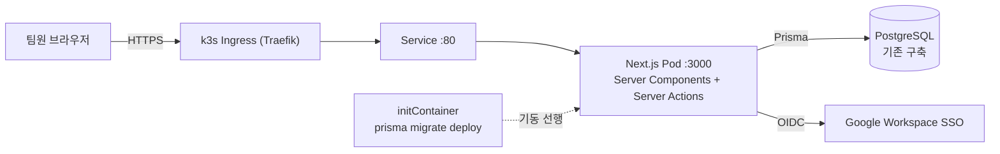
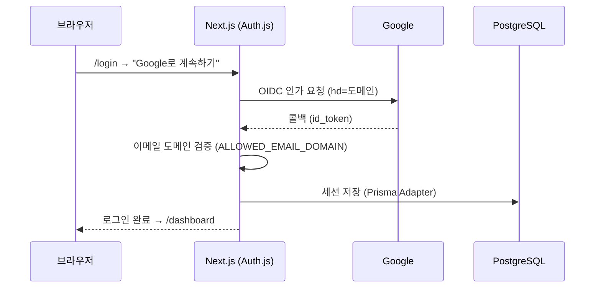
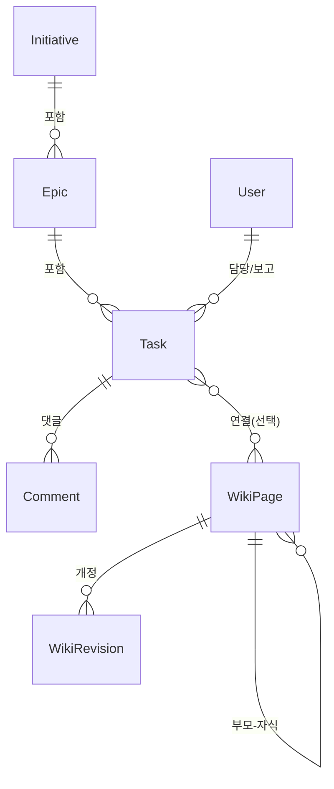
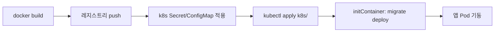

# Sprint — 팀 일정 · 문서 워크스페이스

Jira와 Wiki 역할을 **하나의 Next.js 애플리케이션**에서 함께 제공합니다. 기획자 · PM · 마케터 20명 내외 팀이 일정(Initiative → Epic → Task)과 문서(위키)를 한곳에서 공유하도록 설계했습니다.

## 핵심 기능

**프로젝트 관리 (Jira 역할)**
- 3단계 계층: **이니셔티브 → 에픽 → 태스크**
- 상태 흐름: `백로그 → 할 일 → 진행 중 → 리뷰 → 완료`
- 칸반 **보드**(드래그로 상태 변경), 필터 가능한 **태스크 목록**, **타임라인**(간트), 태스크 **댓글**
- 담당자 · 우선순위 · 시작/마감일 · 스토리 포인트 · 활동 로그

**문서 관리 (Wiki 역할)**
- 트리 구조의 위키 페이지, **Tiptap 리치텍스트 에디터**(제목/목록/체크리스트/인용/코드/링크)
- 자동 저장 · 페이지 개정 이력(revision)

**공통**
- Google Workspace **SSO**(도메인 제한), 팀 전원 공유

## 기술 스택

| 영역 | 선택 |
| --- | --- |
| 프레임워크 | Next.js 16 (App Router, Server Components + Server Actions) |
| 언어 | TypeScript |
| UI | shadcn/ui (Base UI 기반) + Tailwind CSS v4 |
| 에디터 | Tiptap |
| DB / ORM | PostgreSQL + Prisma 6 |
| 인증 | Auth.js (NextAuth v5) — Google OIDC |
| 배포 | Docker (standalone) + k3s |

## 아키텍처



인증 흐름:



## 데이터 모델 (요약)



## 로컬 개발

**요구사항**: Node 20+ (권장 22), PostgreSQL, npm.

```bash
# 1) 의존성 설치 (postinstall 에서 prisma generate 자동 실행)
npm install

# 2) 환경변수
cp .env.example .env
#   DATABASE_URL 을 로컬 Postgres 로 지정
#   AUTH_SECRET 생성:  npx auth secret   (또는 openssl rand -base64 32)
#   GOOGLE_CLIENT_ID / GOOGLE_CLIENT_SECRET 입력 (아래 OAuth 설정 참고)

# 3) DB 스키마 적용
npm run db:migrate      # 개발용 (마이그레이션 생성/적용)
#   또는 기존 DB 에 반영만:  npm run db:deploy

# 4) (선택) 데모 데이터
npm run db:seed

# 5) 실행
npm run dev             # http://localhost:3000
```

## Google OAuth 설정

1. [Google Cloud Console → 사용자 인증 정보](https://console.cloud.google.com/apis/credentials) 에서 **OAuth 2.0 클라이언트 ID** 생성 (유형: 웹 애플리케이션)
2. **승인된 리디렉션 URI** 추가:
   - 로컬: `http://localhost:3000/api/auth/callback/google`
   - 운영: `https://<도메인>/api/auth/callback/google`
3. 발급된 Client ID / Secret 을 `.env`(로컬) 또는 k8s Secret(운영)에 입력
4. `ALLOWED_EMAIL_DOMAIN` 에 회사 도메인(예: `musinsa.com`)을 넣으면 해당 워크스페이스 계정만 로그인 허용

## k3s 배포



```bash
# 1) 이미지 빌드 & 푸시 (레지스트리/태그는 환경에 맞게)
docker build -t ghcr.io/OWNER/sprint:latest .
docker push ghcr.io/OWNER/sprint:latest

# 2) 매니페스트의 이미지/호스트 치환
#    k8s/deployment.yaml : image  → 위 레지스트리 경로
#    k8s/ingress.yaml    : host   → 실제 도메인
#    k8s/configmap.yaml  : AUTH_URL / ALLOWED_EMAIL_DOMAIN

# 3) 시크릿 작성 (예제 복사 후 실제 값 입력, 커밋 금지)
cp k8s/secret.example.yaml k8s/secret.yaml
#    DATABASE_URL(기존 DB) / AUTH_SECRET / GOOGLE_CLIENT_ID / GOOGLE_CLIENT_SECRET

# 4) 적용
kubectl apply -f k8s/namespace.yaml
kubectl apply -f k8s/configmap.yaml
kubectl apply -f k8s/secret.yaml
kubectl apply -f k8s/deployment.yaml -f k8s/service.yaml -f k8s/ingress.yaml
```

- **마이그레이션**: 각 롤아웃 시 `initContainer` 가 `prisma migrate deploy` 를 실행합니다. Prisma 가 advisory lock 을 잡아 다중 파드 동시 배포에도 안전합니다.
- **기존 DB 연결**: `DATABASE_URL` 만 기존 PostgreSQL 로 지정하면 됩니다. 최초 배포 시 `prisma/migrations/0_init` 이 적용되어 테이블이 생성됩니다.
- **헬스체크**: `/api/health` (DB 미의존) 를 readiness/liveness 로 사용합니다.

## 프로젝트 구조

```
prisma/
  schema.prisma          # 데이터 모델
  migrations/            # 0_init 베이스라인
  seed.ts                # 데모 데이터
src/
  auth.ts                # Auth.js (Google SSO)
  app/
    (app)/               # 인증 필요 영역 (사이드바 셸)
      dashboard | initiatives | epics | board | tasks | timeline | wiki
    login/               # 로그인
    api/auth | api/health
  components/            # ui(shadcn) + 기능 컴포넌트
  server/
    queries.ts           # 읽기(서버)
    actions/             # 쓰기(Server Actions)
k8s/                     # namespace/configmap/secret/deployment/service/ingress
Dockerfile               # 멀티스테이지 standalone + Prisma 엔진
```

## 스크립트

| 명령 | 설명 |
| --- | --- |
| `npm run dev` | 개발 서버 |
| `npm run build` / `start` | 프로덕션 빌드 / 실행 |
| `npm run db:migrate` | 마이그레이션 생성·적용(dev) |
| `npm run db:deploy` | 마이그레이션 적용(prod) |
| `npm run db:seed` | 데모 데이터 |
| `npm run db:studio` | Prisma Studio |
