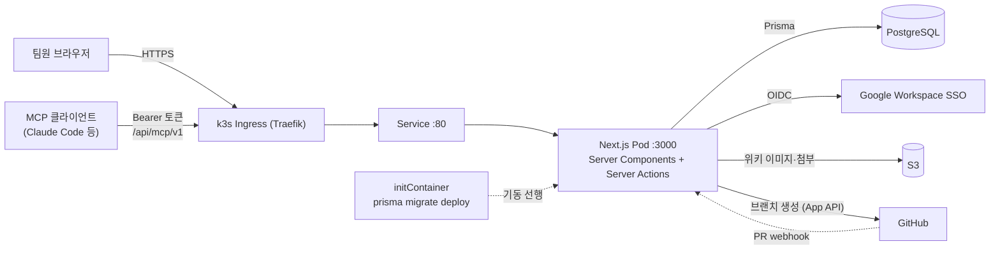
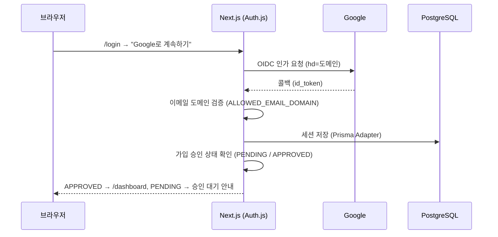
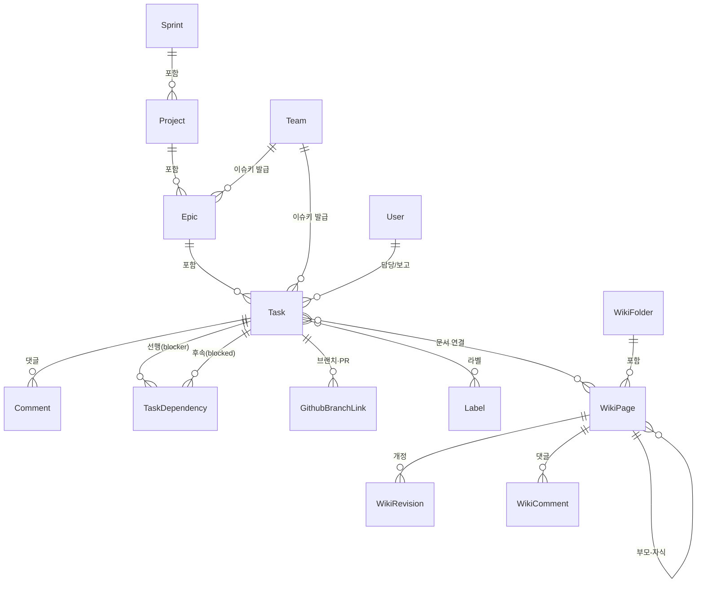
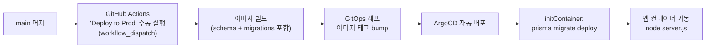

# Sprint — 팀 일정 · 문서 워크스페이스

Sprint는 이슈 트래커와 위키를 **하나의 Next.js 애플리케이션**에서 함께 제공하는 워크스페이스입니다. 기획자 · PM · 마케터 20명 내외 팀이 일정(스프린트 → 프로젝트 → 에픽 → 태스크)과 문서를 한곳에서 공유하도록 설계했습니다.

## 핵심 기능

**이슈 트래킹**

- 4단계 계층 : 스프린트 → 프로젝트 → 에픽 → 태스크. 상위 연결은 모두 선택적이라 태스크만 단독으로도 만들 수 있음
- 팀 단위 이슈키 : 에픽·태스크는 팀에 소속되고 `NEKI-42` 형태의 키를 받음
- 상태 `할 일 → 진행 중 → 완료`(스프린트만 `예정 / 진행 / 완료`), 우선순위 4단계, 담당자(사용자 또는 팀), 참조(c.c.), 시작·종료일
- 맨데이(MD) 추정 : 태스크에만 입력하고 에픽·프로젝트는 하위 합으로 롤업(읽기 전용)
- 칸반 보드 : 드래그로 상태 변경 + 컬럼 내 순서 재정렬
- 타임라인(간트)
- 목록 : 인라인 편집, 슬라이드 상세, URL 파라미터 기반 정렬·필터, 사용자별 컬럼 설정
- 라벨, 태스크 의존성(blocks / blockedBy, 순환은 서버가 거부), 활동 로그

**위키**

- 폴더·페이지 트리, 즐겨찾기, 초안, 휴지통(soft delete), 개정 이력
- Tiptap 리치 에디터 : 표, 구문 강조 코드블록, mermaid, 이미지(S3 업로드 · 리사이즈 · 정렬 · 라이트박스), 파일 첨부, 글자색/배경색, 정렬, 슬래시 커맨드, 블록 핸들
- 본문 전문 검색, 페이지 댓글과 인라인 댓글(구글 독스 방식)
- 스프린트 · 프로젝트 · 에픽 · 태스크와 양방향 링크

**협업**

- 댓글 : 엔티티 4종과 위키가 공용 컴포넌트를 사용. 입력창에서 `#티켓` · `@멘션` 지원
- 멘션은 멤버와 팀을 함께 검색하고, 팀 멘션은 저장 시 팀원 전원 알림으로 확장됨
- 알림 벨(폴링 방식, 실시간 소켓 아님), 공지, `⌘K` 전역 검색

**연동**

- MCP 서버 `@neki-team/sprint-mcp` : Claude Code · Claude Desktop · Cursor 등에서 티켓·위키를 조작. 개인 API 토큰(Bearer)으로 `/api/mcp/v1` 을 호출하며, 설치 방법은 [`mcp/README.md`](./mcp/README.md) 참고
- GitHub App : 태스크에서 브랜치 생성, webhook 으로 PR 상태 역동기화
- OG 링크 미리보기(Slack 등에서 티켓·위키 링크 카드)

**인증**

- Google Workspace SSO. `ALLOWED_EMAIL_DOMAIN` 도메인 제한에 더해, 가입 승인 게이트(`PENDING → APPROVED`)를 통과해야 앱에 진입할 수 있음
- 승인 전 계정은 웹 화면뿐 아니라 개인 토큰(MCP API)까지 함께 잠김

## 기술 스택

| 영역 | 선택 |
| --- | --- |
| 프레임워크 | Next.js 16 (App Router, Server Components + Server Actions) |
| 언어 | TypeScript |
| UI | shadcn/ui (Base UI 기반) + Tailwind CSS v4 |
| 에디터 | Tiptap 3 |
| DB / ORM | PostgreSQL + Prisma 6 |
| 인증 | Auth.js (NextAuth v5) — Google OIDC |
| 스토리지 | S3 (위키 이미지 · 첨부 파일) |
| 테스트 | Vitest |
| 배포 | Docker (standalone) + k3s + ArgoCD(GitOps) |

## 아키텍처


```mermaid
flowchart LR
    U["팀원 브라우저"] -->|HTTPS| ING["k3s Ingress (Traefik)"]
    M["MCP 클라이언트<br/>(Claude Code 등)"] -->|"Bearer 토큰<br/>/api/mcp/v1"| ING
    ING --> SVC["Service :80"]
    SVC --> POD["Next.js Pod :3000<br/>Server Components + Server Actions"]
    POD -->|Prisma| DB[("PostgreSQL")]
    POD -->|OIDC| G["Google Workspace SSO"]
    POD -->|위키 이미지·첨부| S3[("S3")]
    POD -->|"브랜치 생성 (App API)"| GH["GitHub"]
    GH -.->|"PR webhook"| POD
    INIT["initContainer<br/>prisma migrate deploy"] -.->|기동 선행| POD
```

인증 흐름:


```mermaid
sequenceDiagram
    participant B as 브라우저
    participant A as Next.js (Auth.js)
    participant G as Google
    participant D as PostgreSQL
    B->>A: /login → "Google로 계속하기"
    A->>G: OIDC 인가 요청 (hd=도메인)
    G-->>A: 콜백 (id_token)
    A->>A: 이메일 도메인 검증 (ALLOWED_EMAIL_DOMAIN)
    A->>D: 세션 저장 (Prisma Adapter)
    A->>A: 가입 승인 상태 확인 (PENDING / APPROVED)
    A-->>B: APPROVED → /dashboard, PENDING → 승인 대기 안내
```

## 데이터 모델 (요약)


```mermaid
erDiagram
    Sprint ||--o{ Project : "포함"
    Project ||--o{ Epic : "포함"
    Epic ||--o{ Task : "포함"
    Team ||--o{ Epic : "이슈키 발급"
    Team ||--o{ Task : "이슈키 발급"
    User ||--o{ Task : "담당/보고"
    Task ||--o{ Comment : "댓글"
    Task ||--o{ TaskDependency : "선행(blocker)"
    Task ||--o{ TaskDependency : "후속(blocked)"
    Task ||--o{ GithubBranchLink : "브랜치·PR"
    Task }o--o{ Label : "라벨"
    Task }o--o{ WikiPage : "문서 연결"
    WikiFolder ||--o{ WikiPage : "포함"
    WikiPage ||--o{ WikiPage : "부모-자식"
    WikiPage ||--o{ WikiRevision : "개정"
    WikiPage ||--o{ WikiComment : "댓글"
```

공지 · 알림 · API 토큰 · 활동 로그 등 부가 모델은 생략했습니다. 정본은 [`prisma/schema.prisma`](./prisma/schema.prisma) 입니다.

## 로컬 개발

**요구사항** : Node 22(CI · 런타임 이미지 기준), PostgreSQL, npm.

```bash
# 1) 의존성 설치 (postinstall 에서 prisma generate 자동 실행)
npm install

# 2) 환경변수
cp .env.example .env
#   DATABASE_URL 을 로컬 Postgres 로 지정
#   AUTH_SECRET 생성:  npx auth secret   (또는 openssl rand -base64 32)
#   GOOGLE_CLIENT_ID / GOOGLE_CLIENT_SECRET 입력 (아래 OAuth 설정 참고)
#   위키 이미지 업로드·GitHub 연동을 쓰려면 S3_* / GITHUB_APP_* 도 채운다

# 3) DB 스키마 적용
npm run db:migrate      # 개발용 (마이그레이션 생성/적용)
#   또는 기존 DB 에 반영만:  npm run db:deploy

# 4) (선택) 데모 데이터
npm run db:seed

# 5) 실행
npm run dev             # http://localhost:3000
```

스키마를 바꾼 뒤에는 `next dev` 가 옛 Prisma client 를 물고 있으므로 **dev 서버를 재시작해야 합니다.** 이 함정을 포함한 주의사항은 [`docs/gotchas.md`](./docs/gotchas.md) 에 정리돼 있습니다.

## Google OAuth 설정

1. [Google Cloud Console → 사용자 인증 정보](https://console.cloud.google.com/apis/credentials) 에서 **OAuth 2.0 클라이언트 ID** 생성 (유형: 웹 애플리케이션)
2. **승인된 리디렉션 URI** 추가:
   - 로컬: `http://localhost:3000/api/auth/callback/google`
   - 운영: `https://<도메인>/api/auth/callback/google`
3. 발급된 Client ID / Secret 을 `.env`(로컬) 또는 k8s Secret(운영)에 입력
4. `ALLOWED_EMAIL_DOMAIN` 에 회사 도메인(예: `musinsa.com`)을 넣으면 해당 워크스페이스 계정만 로그인할 수 있습니다. 도메인을 통과해도 승인 전까지는 `PENDING` 상태로 `/pending` 화면에서 대기합니다.

승인 전환 UI 는 아직 없습니다. 운영자가 DB 에서 직접 `UPDATE "User" SET "status" = 'APPROVED'` 로 처리하며, database 세션 전략이라 재로그인 없이 다음 요청부터 반영됩니다.

## 배포 (k3s + GitOps)

k8s 매니페스트는 이 레포가 아니라 **GitOps 레포 `Team-Neki-GitOps`** 에 있습니다. 앱 레포는 이미지를 빌드해 태그만 bump 하고, 실제 적용은 ArgoCD 가 담당합니다.


```mermaid
flowchart LR
    A["main 머지"] --> B["GitHub Actions<br/>'Deploy to Prod' 수동 실행<br/>(workflow_dispatch)"]
    B --> C["이미지 빌드<br/>(schema + migrations 포함)"]
    C --> D["GitOps 레포<br/>이미지 태그 bump"]
    D --> E["ArgoCD 자동 배포"]
    E --> F["initContainer:<br/>prisma migrate deploy"]
    F --> G["앱 컨테이너 기동<br/>node server.js"]
```

- **배포 트리거** : main 머지만으로는 배포되지 않습니다. Actions 탭에서 "Deploy to Prod" 를 수동 실행해야 합니다
- **마이그레이션** : 롤아웃마다 initContainer 가 `prisma migrate deploy` 를 실행합니다. Prisma 가 advisory lock 을 잡으므로 다중 파드 동시 배포에도 안전하며, 로컬에서 손으로 적용할 필요가 없습니다. 대신 스키마를 바꾸면 마이그레이션 SQL 을 **반드시 커밋에 포함**해야 합니다
- **베이스라인** : 최초 배포 시 `prisma/migrations/20260707170339_sprint_project_team` 이 테이블을 생성하고, 이후 마이그레이션이 차례로 적용됩니다
- **빌드 인자** : `NEXT_PUBLIC_APP_URL` 은 `next build` 시점에 번들로 인라인되므로 ConfigMap 이 아니라 Dockerfile build arg 로 주입합니다
- **헬스체크** : `/api/health`(DB 미의존)를 readiness / liveness 로 사용합니다

CI(`.github/workflows/ci.yml`)는 모든 push · PR 에서 lint → typecheck → test → build 를 실행합니다.

## 프로젝트 구조

```text
prisma/
  schema.prisma          # 데이터 모델(정본)
  migrations/            # 20260707170339_sprint_project_team 이 베이스라인
  seed.ts                # 데모 데이터
src/
  auth.ts                # Auth.js (Google SSO + 승인 게이트)
  app/
    (app)/               # 인증 필요 영역 (사이드바 셸)
      dashboard | sprints | projects | epics | tasks | board | timeline
      wiki | announcements | labels | notifications | teams | users
    login/               # 로그인
    pending/             # 가입 승인 대기 (앱 셸 밖)
    api/                 # auth | health | mcp/v1 | github | wiki
  components/            # ui(shadcn) + 기능별 컴포넌트
  lib/                   # 순수 로직 (validators, order, mentions, s3, github ...)
  server/
    queries.ts           # 읽기(서버)
    actions/             # 쓰기(Server Actions)
tests/                   # Vitest. src/ 구조를 미러링
mcp/                     # MCP 서버 패키지 (@neki-team/sprint-mcp)
docs/                    # 설계 · 이력 · 가이드 문서
Dockerfile               # 멀티스테이지 standalone + Prisma CLI(마이그레이션용)
```

## 스크립트

| 명령 | 설명 |
| --- | --- |
| `npm run dev` | 개발 서버 |
| `npm run build` / `start` | 프로덕션 빌드 / 실행 |
| `npm run lint` | ESLint |
| `npm run test` / `test:watch` | Vitest 유닛 테스트 |
| `npm run db:migrate` | 마이그레이션 생성·적용(dev) |
| `npm run db:deploy` | 마이그레이션 적용(운영 initContainer 가 사용) |
| `npm run db:push` | 마이그레이션 없이 스키마를 DB 에 직접 반영 |
| `npm run db:generate` | Prisma client 재생성 |
| `npm run db:seed` | 데모 데이터 |
| `npm run db:studio` | Prisma Studio |
| `npm run og:font` | OG 이미지용 Pretendard 서브셋 폰트 생성 (uv 필요) |

## 문서

| 문서 | 내용 |
| --- | --- |
| [`docs/README.md`](./docs/README.md) | 문서 인덱스(설계 · 이력 · 백로그 · ADR) |
| [`docs/gotchas.md`](./docs/gotchas.md) | 실제로 물렸던 엔지니어링 함정 |
| [`DESIGN.md`](./DESIGN.md) | 디자인 토큰 정본 |
| [`CLAUDE.md`](./CLAUDE.md) | 기여자 · 에이전트 작업 규칙 |
| [`mcp/README.md`](./mcp/README.md) | MCP 서버 설치 · 팀 배포 · 게시 |
