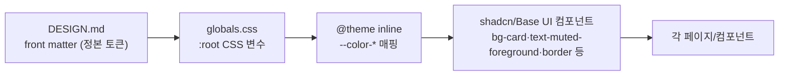
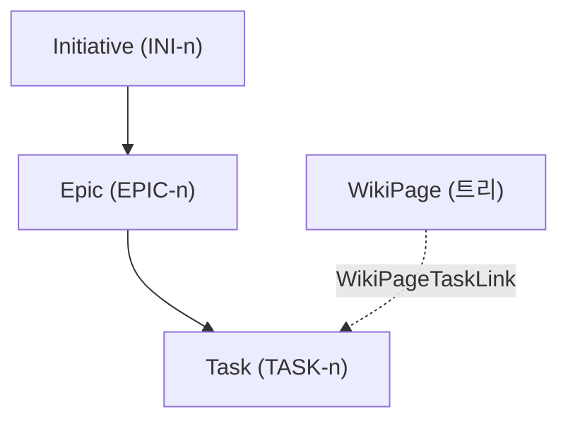

# 디자인 시스템 (구현 기준)

> 정본 토큰 소스는 프로젝트 루트 [`DESIGN.md`](../DESIGN.md)의 front matter다. 이 문서는 그 토큰이 코드에 **어떻게 매핑되어 있는지**와 실제 사용 규칙을 설명한다. 색을 바꿀 땐 하드코딩하지 말고 `src/app/globals.css`의 CSS 변수를 통해 반영한다.

## 테마 개요

Vercel 계열 **near-white 라이트 전용** 테마. 이전의 Intercom cream 테마(`#f5f1ec`)에서 이관되었다.

- **캔버스**: `--background` = `#fafafa` (canvas-soft, 98% 흰색 — 페이지 본문)
- **카드**: `--card` = `#ffffff` (canvas, 순수 흰색 — 떠 있는 타일)
- **인셋 면**: `--secondary`/`--muted`/`--accent` = `#f5f5f5` (canvas-soft-2)
- **잉크**: `--foreground`/`--primary` = `#171717` (본문 텍스트 + 단일 primary/CTA)
- **보조 텍스트**: `--muted-foreground` = `#4d4d4d` (body)
- **헤어라인**: `--border`/`--input` = `#ebebeb` (1px 구분선/보더)
- **링크**: `--link` = `#0070f3` (인라인 링크 전용 — tiptap 본문 링크에 적용)

깊이(depth)는 그림자가 아니라 **surface ladder(#fafafa→#ffffff→#f5f5f5) + inset hairline ring**으로 표현한다. `Card`는 `ring-1 ring-foreground/10`(DESIGN.md Level 1 inset hairline)을 쓰며, 무거운 단일 drop-shadow는 금지다.

## 색 토큰 매핑 (`src/app/globals.css` `:root`)

| 시맨틱 변수 | 값 | DESIGN.md 토큰 |
|---|---|---|
| `--background` | `#fafafa` | canvas-soft |
| `--card` / `--popover` | `#ffffff` | canvas |
| `--foreground` / `--primary` | `#171717` | ink |
| `--primary-foreground` | `#ffffff` | on-primary |
| `--secondary` / `--muted` / `--accent` | `#f5f5f5` | canvas-soft-2 |
| `--muted-foreground` | `#4d4d4d` | body |
| `--border` / `--input` | `#ebebeb` | hairline |
| `--ring` | `#171717` | ink (focus, /50) |
| `--destructive` | `#ee0000` | error |
| `--link` | `#0070f3` | link |
| `--chart-1..5` | `#007cf0` `#7928ca` `#ff0080` `#f9cb28` `#00dfd8` | 브랜드 그라디언트(develop/preview/highlight/ship) |

`--radius` = `0.5rem`(8px) — 카드는 `rounded.lg`(8px), 버튼/인풋은 `@theme inline`의 `--radius-md/sm` 파생값으로 더 작게. round 는 살짝만(과거 12px 에서 축소).

## 타이포그래피

- 폰트: **Geist**(sans) + **Geist Mono** — `src/app/layout.tsx`에서 `next/font/google`로 로드, `--font-geist-sans`/`--font-geist-mono` 변수로 노출.
- display/heading은 공격적 negative tracking이 브랜드 보이스: `globals.css` base 레이어에서 `h1,h2,h3 { letter-spacing: -0.025em }`.
- 기술 라벨(키, 코드)은 mono(`font-mono`). 예: `INI-3`, `TASK-42` 키 표기.

## 라이트 전용 규칙

- `layout.tsx`의 `<html>`에는 `.dark` 클래스를 **붙이지 않는다**. `:root`가 라이트 값이고 `.dark` 오버라이드 블록이 없으므로 라이트 전용이 정합 상태다.
- `globals.css` base 레이어에 `html { color-scheme: light }`.
- Toaster는 `theme="light"`.
- UI 컴포넌트의 `dark:` variant는 라이트 base 위에 얹히는 추가 스타일이라, `.dark`가 없으면 자동으로 비활성(무해)된다.

## 상태·우선순위 색 (`src/lib/constants.ts`)

흰 배경 대비를 위해 텍스트는 `-600`대, dot은 채도 유지(`-500`), 중립 상태는 그레이(모노톤 유지). DESIGN.md의 "여섯 번째 액센트 금지" 원칙의 in-product 예외(기능적 상태 색).

- STATUS: 백로그=neutral, 할 일=blue, 진행 중=amber, 완료=emerald (리뷰/IN_REVIEW 는 2026-07-09 제거)
- PRIORITY: 긴급=red-600, 높음=orange-600, 보통=neutral-600, 낮음=neutral-400

## 공용 컴포넌트 패턴

### `ItemRow` (`src/components/item-row.tsx`)

이니셔티브·에픽 목록의 **공용 행**. 고정 뼈대(`Link`+`Card` · 키 · 제목 · 우선순위 · 담당자 · 상태)를 공유하고, 항목별로 다른 보조정보는 `meta` 슬롯(`RowMeta` 헬퍼)으로 주입한다.

- 캐노니컬 컬럼 순서: `[키] [제목(flex-1)] [우선순위] [meta] [담당자] [상태]`
- 키 컬럼 폭은 `w-20`으로 통일(이니셔티브/에픽 정렬 일치)
- 행 레이아웃을 바꾸려면 `item-row.tsx` 한 곳만 수정하면 두 목록에 동시 반영된다.
- 태스크 목록은 이 패턴이 아니라 `<Table>`(표) 기반이라 별개다.

### 엔티티 계층

## 참고

- 공용 프리미티브(`Card`, `badges.tsx`, `page-header.tsx`, `user-badge.tsx`, `forms/fields.tsx`)는 모두 토큰 기반이라 토큰 변경이 전 화면에 일관 전파된다.
- 변경 이력은 [`work-log.md`](./work-log.md), 예정 작업은 [`roadmap.md`](./roadmap.md) 참고.
