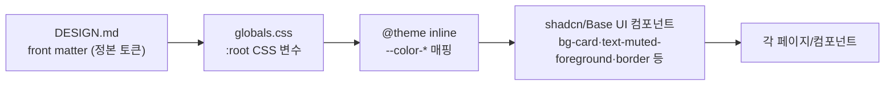
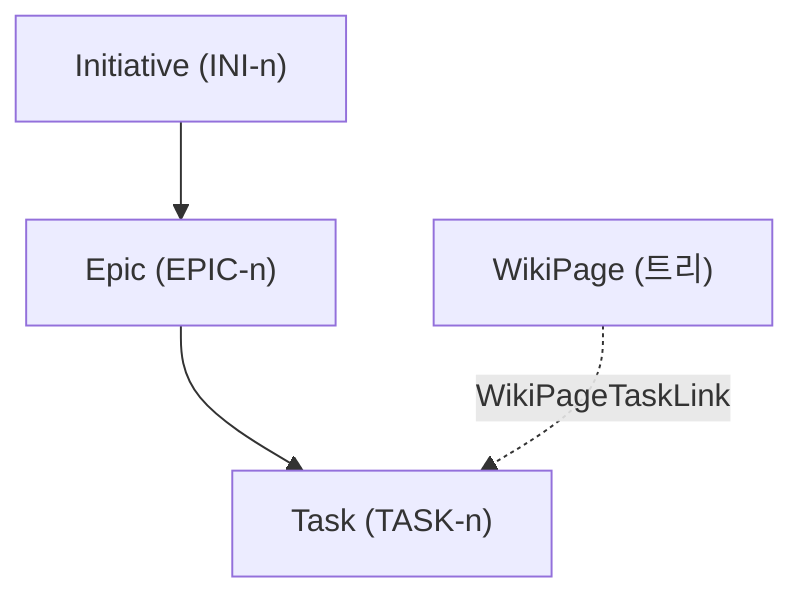

# 디자인 시스템 (구현 기준)

> 정본 토큰 소스는 프로젝트 루트 [`DESIGN.md`](../DESIGN.md)의 front matter다. 이 문서는 그 토큰이 코드에 **어떻게 매핑되어 있는지**와 실제 사용 규칙을 설명한다. 색을 바꿀 땐 하드코딩하지 말고 `src/app/globals.css`의 CSS 변수를 통해 반영한다.

## 테마 개요

Vercel 계열 **near-white 라이트 전용** 테마. 이전의 Intercom cream 테마(`#f5f1ec`)에서 이관되었다.

- **캔버스**: `--background` = `#fafafa` (canvas-soft, 98% 흰색 — 페이지 본문)
- **카드**: `--card` = `#ffffff` (canvas, 순수 흰색 — 떠 있는 타일)
- **인셋 면**: `--secondary`/`--muted`/`--accent` = `#f5f5f5` (canvas-soft-2)
- **잉크**: `--foreground`/`--primary` = `#171717` (본문 텍스트 + 단일 primary/CTA)
- **보조 텍스트**: `--muted-foreground` = `#4d4d4d` (body)
- **헤어라인**: `--border`/`--input` = `#ebebeb` (1px 구분선/보더)
- **링크**: `--link` = `#0070f3` (인라인 링크 전용 — tiptap 본문 링크에 적용)

깊이(depth)는 그림자가 아니라 **surface ladder(#fafafa→#ffffff→#f5f5f5) + inset hairline ring**으로 표현한다. `Card`는 `ring-1 ring-foreground/10`(DESIGN.md Level 1 inset hairline)을 쓰며, 무거운 단일 drop-shadow는 금지다.


```mermaid
flowchart LR
    DM["DESIGN.md<br/>front matter (정본 토큰)"] --> GC["globals.css<br/>:root CSS 변수"]
    GC --> TH["@theme inline<br/>--color-* 매핑"]
    TH --> CMP["shadcn/Base UI 컴포넌트<br/>bg-card·text-muted-foreground·border 등"]
    CMP --> PG["각 페이지/컴포넌트"]
```

## 색 토큰 매핑 (`src/app/globals.css` `:root`)

| 시맨틱 변수 | 값 | DESIGN.md 토큰 |
|---|---|---|
| `--background` | `#fafafa` | canvas-soft |
| `--card` / `--popover` | `#ffffff` | canvas |
| `--foreground` / `--primary` | `#171717` | ink |
| `--primary-foreground` | `#ffffff` | on-primary |
| `--secondary` / `--muted` / `--accent` | `#f5f5f5` | canvas-soft-2 |
| `--muted-foreground` | `#4d4d4d` | body |
| `--border` / `--input` | `#ebebeb` | hairline |
| `--ring` | `#171717` | ink (focus, /50) |
| `--destructive` | `#ee0000` | error |
| `--link` | `#0070f3` | link |
| `--chart-1..5` | `#007cf0` `#7928ca` `#ff0080` `#f9cb28` `#00dfd8` | 브랜드 그라디언트(develop/preview/highlight/ship) |

`--radius` = `0.5rem`(8px) — 카드는 `rounded.lg`(8px), 버튼/인풋은 `@theme inline`의 `--radius-md/sm` 파생값으로 더 작게. round 는 살짝만(과거 12px 에서 축소).

## 타이포그래피

- 폰트: **Geist**(sans) + **Geist Mono** — `src/app/layout.tsx`에서 `next/font/google`로 로드, `--font-geist-sans`/`--font-geist-mono` 변수로 노출.
- display/heading은 공격적 negative tracking이 브랜드 보이스: `globals.css` base 레이어에서 `h1,h2,h3 { letter-spacing: -0.025em }`.
- 기술 라벨(키, 코드)은 mono(`font-mono`). 예: `INI-3`, `TASK-42` 키 표기.

## 라이트 전용 규칙

- `layout.tsx`의 `<html>`에는 `.dark` 클래스를 **붙이지 않는다**. `:root`가 라이트 값이고 `.dark` 오버라이드 블록이 없으므로 라이트 전용이 정합 상태다.
- `globals.css` base 레이어에 `html { color-scheme: light }`.
- Toaster는 `theme="light"`.
- UI 컴포넌트의 `dark:` variant는 라이트 base 위에 얹히는 추가 스타일이라, `.dark`가 없으면 자동으로 비활성(무해)된다.

## 상태·우선순위 색 (`src/lib/constants.ts`)

흰 배경 대비를 위해 텍스트는 `-600`대, dot은 채도 유지(`-500`), 중립 상태는 그레이(모노톤 유지). DESIGN.md의 "여섯 번째 액센트 금지" 원칙의 in-product 예외(기능적 상태 색).

- STATUS: 백로그=neutral, 할 일=blue, 진행 중=amber, 완료=emerald (리뷰/IN_REVIEW 는 2026-07-09 제거)
- PRIORITY: 긴급=red-600, 높음=orange-600, 보통=neutral-600, 낮음=neutral-400

## 공용 컴포넌트 패턴

### `ItemRow` (`src/components/item-row.tsx`)

이니셔티브·에픽 목록의 **공용 행**. 고정 뼈대(`Link`+`Card` · 키 · 제목 · 우선순위 · 담당자 · 상태)를 공유하고, 항목별로 다른 보조정보는 `meta` 슬롯(`RowMeta` 헬퍼)으로 주입한다.

- 캐노니컬 컬럼 순서: `[키] [제목(flex-1)] [우선순위] [meta] [담당자] [상태]`
- 키 컬럼 폭은 `w-20`으로 통일(이니셔티브/에픽 정렬 일치)
- 행 레이아웃을 바꾸려면 `item-row.tsx` 한 곳만 수정하면 두 목록에 동시 반영된다.
- 태스크 목록은 이 패턴이 아니라 `<Table>`(표) 기반이라 별개다.

### 엔티티 계층


```mermaid
flowchart TD
    INI["Initiative (INI-n)"] --> EPIC["Epic (EPIC-n)"]
    EPIC --> TASK["Task (TASK-n)"]
    WIKI["WikiPage (트리)"] -. WikiPageTaskLink .-> TASK
```

## 엔티티 목록/상세 화면 규격

스프린트·프로젝트·에픽·태스크 네 엔티티는 서로 다른 계층을 가리키지만, 사용자가 하는 일은 같습니다. 목록에서 고르고, 상세에서 값을 고치고, 하위 항목을 추가하고, 댓글과 히스토리를 봅니다. **따라서 네 화면은 같은 조작 규격을 공유해야 하고, 예외는 데이터 모델에 근거가 있을 때만 둡니다.** 근거 없이 갈린 차이는 한 화면에서 익힌 조작이 다른 화면에서 통하지 않게 만듭니다(BACKEND-47/48/49에서 실제로 정리한 부채).

### 목록 화면

```text
PageHeader(제목 · 설명 · 생성 CTA)
  -> 필터 행 [필터들]                    [ColumnSettings]
  -> Card(overflow-hidden py-0) > EntityTable
```

- 표 셸은 `tables/entity-table.tsx` 하나를 공유하고, 컬럼 정의만 `tables/*-columns.tsx`에서 주입함
- 항목이 0건이어도 **표를 걷어내지 않음**. 컬럼 헤더를 남기고 표 안 `EmptyRow`로 안내(필터를 조정할 수 있어야 하므로). 별도 `EmptyState` 전환은 쓰지 않음
- 정렬은 URL(`?sort=&dir=`) 기반. 페이지가 `parseListSort(sp, *_SORT_FIELDS)`로 검증해 쿼리에 넘기고, 표에 `sortable`을 주면 `sortField` 있는 헤더가 `SortableHead`로 렌더됨
- 정렬 가능 필드는 DB 컬럼만입니다. 담당자·레이블(관계)과 MD(하위 롤업 계산값)는 제외합니다
- 명시적 정렬이 걸리면 기본 정렬의 상태 재배치(진행중→할 일→완료)는 적용하지 않음

### 상세 화면

```text
@container/detail (max-w-5xl) > grid @3xl:grid-cols-3
  좌 2단: BackButton · InlineTitle · 설명 Card · [하위 목록] · CommentsHistoryTabs
  우 1단: 메타 Card(MetaRow 나열) · [엔티티별 카드] · 위키 연결 Card
```

- 두 컬럼 모두 `min-w-0`을 줍니다. grid 아이템 기본값이 `min-width:auto`라 긴 코드블록이나 URL이 들어오면 컬럼이 밀립니다
- 제목·설명·메타는 인라인 편집이 기본. 상세에는 수정 다이얼로그를 두지 않음(생성만 다이얼로그)
- 설명 카드는 값이 비어도 항상 렌더. 카드째 숨기면 상세에서 설명을 새로 쓸 수 없음
- 댓글·업무 히스토리는 `detail/comments-history-tabs.tsx` 탭으로 통일. 카드로 나열하지 않음
- 뒤로가기(`BackButton`)와 삭제 후 이동은 **자기 목록**으로. 태스크 상세는 보드에서도 열리지만 `/tasks`로 돌아갑니다
- 목록 → 상세는 우측 슬라이드(`@detail` 인터셉트 라우트). 네 엔티티 모두 세그먼트에 `layout.tsx` + `@detail/(.)[id]` + `@detail/default.tsx`를 둡니다

### 모델 차이로 정당한 예외

이 셋은 통일 대상이 아니라 스키마에서 나온 차이입니다.

- 이슈 key : 태스크·에픽만 팀 접두어 key가 있어 맨 앞 `키` 컬럼(`OpenDetailKey`)으로 상세를 엽니다. key가 없는 프로젝트·스프린트는 맨 뒤 아이콘 컬럼(`OpenDetailIcon`)이 같은 역할을 합니다
- 스프린트 메타 : `Sprint` 모델에는 담당자·우선순위·팀이 없어 해당 `MetaRow`를 두지 않습니다. 제목 필드가 `name`, 기한이 `endDate`, 상태가 `SprintStatus`라 `InlineTitle field="name"` · `InlineDate field="endDate"` · `InlineSprintStatus`를 씁니다
- 태스크 전용 : 의존성·GitHub 카드는 태스크에만 있고, 하위 목록은 태스크에만 없습니다(최하위 계층)

## 참고

- 공용 프리미티브(`Card`, `badges.tsx`, `page-header.tsx`, `user-badge.tsx`, `forms/fields.tsx`)는 모두 토큰 기반이라 토큰 변경이 전 화면에 일관 전파된다.
- 변경 이력은 [`work-log.md`](./work-log.md), 예정 작업은 [`roadmap.md`](./roadmap.md) 참고.
