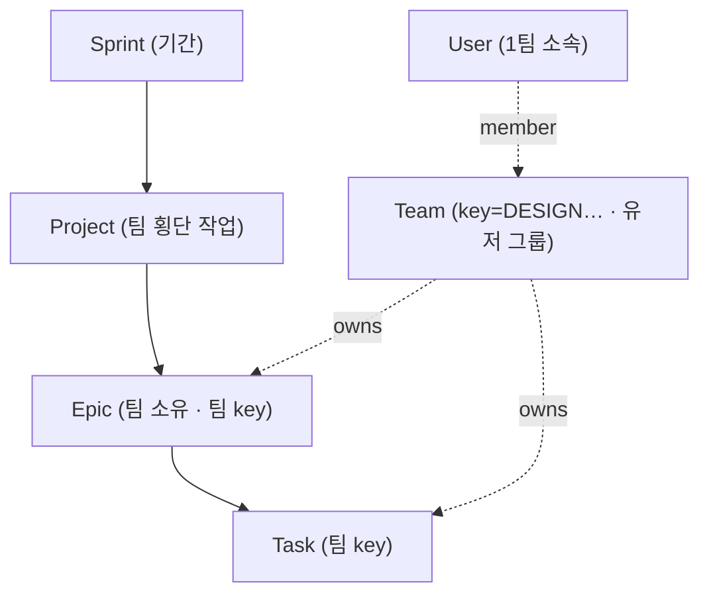

# Spec #2+#3+#4 — Sprint / Project / Team 계층 개편

- **결정**: [ADR 0002](../adr/0002-sprint-project-team-restructure.md)
- **규모**: XL · **스키마 변경**: 대(모델 신설·전환 + 데이터 마이그레이션) · **상태**: TODO(스펙 승인 대기)

## 목표 계층



- Initiative 제거. 표시 key = `<Team.key>-<number>` (Epic·Task 공통, 팀 단위 연속).

## 데이터 모델 (Prisma, 목표)

```prisma
model Sprint {
  id        String   @id @default(cuid())
  name      String
  startDate DateTime?
  endDate   DateTime?
  status    SprintStatus @default(PLANNED)  // PLANNED | ACTIVE | DONE
  projects  Project[]
  createdAt DateTime @default(now())
  updatedAt DateTime @updatedAt
}

model Project {            // 기존 Initiative 를 전환
  id          String   @id @default(cuid())
  title       String
  description String?  @db.Text
  status      Status   @default(BACKLOG)
  priority    Priority @default(MEDIUM)
  startDate   DateTime?
  dueDate     DateTime?
  ownerId     String?
  owner       User?    @relation("ProjectOwner", fields: [ownerId], references: [id])
  sprintId    String?
  sprint      Sprint?  @relation(fields: [sprintId], references: [id], onDelete: SetNull)
  epics       Epic[]
  createdAt   DateTime @default(now())
  updatedAt   DateTime @updatedAt
}

model Team {
  id       String @id @default(cuid())
  key      String @unique          // "DESIGN" — 이슈 key 접두어
  name     String
  color    String?
  seq      Int    @default(0)       // 팀 단위 이슈 번호 카운터(epic+task 공유)
  members  User[]
  epics    Epic[]
  tasks    Task[]
}

model Epic {
  id         String  @id @default(cuid())
  number     Int                     // 팀 시퀀스. 표시 key = team.key-number
  teamId     String
  team       Team    @relation(fields: [teamId], references: [id])
  projectId  String?                 // 구 initiativeId
  project    Project? @relation(fields: [projectId], references: [id], onDelete: SetNull)
  // title/description/status/priority/dates/owner 기존 유지
  @@unique([teamId, number])
}

model Task {
  id       String @id @default(cuid())
  number   Int
  teamId   String
  team     Team   @relation(fields: [teamId], references: [id])
  epicId   String?
  // 기존 필드 유지
  @@unique([teamId, number])
}

model User {
  // 기존 필드 + 팀 소속(단일)
  teamId String?
  team   Team?  @relation(fields: [teamId], references: [id])
}
```

### key 번호 규칙

- 팀 단위 **연속 시퀀스**, epic·task 공유. Epic/Task 생성 시 `Team.seq`를 **트랜잭션 내 원자적 증가** 후 `number`에 부여.
- Task는 생성 시점 Epic의 팀을 상속(`teamId` 고정). 이후 다른 팀 에픽으로 이동해도 key는 안정(재번호 없음).
- `@@unique([teamId, number])`로 표내 중복 방지. epic/task 교차 중복은 공유 카운터의 원자적 증가로 예방.

## 마이그레이션 계획 (단일 원자 마이그레이션 + 백필)

1. `Sprint`·`Team` 모델 신설. `SprintStatus` enum 추가.
2. **Initiative → Project 전환**: 테이블/모델 rename, `Epic.initiativeId` → `projectId` rename(FK/관계명 포함). 에픽 부모 링크 보존.
3. 기본 Sprint("기본 스프린트") 1개 생성, 모든 Project(구 Initiative)에 `sprintId` 백필.
4. 팀 시드: `DESIGN, FRONTEND, BACKEND, AOS, IOS, MARKETING, PM`.
5. 기존 Epic/Task에 기본 팀(예: `PM` 또는 신설 `GENERAL`) `teamId` 백필.
6. `Epic.number`/`Task.number` 백필: 팀별로 epic+task를 `createdAt` 순 연속 번호 부여, `Team.seq`를 max로 세팅. (기존 전역 `key Int autoincrement`는 제거)
7. `User.teamId`(nullable) 추가. 초기 배정은 운영자가 이후 수행(또는 시드에서 일부).

> 주의(AGENTS.md): 이 Next.js/Prisma 버전 특성상 마이그레이션·rename 작성 전 `node_modules/next/dist/docs/` 및 Prisma 마이그레이션 방식 확인. rename은 Prisma가 drop/create로 처리하지 않도록 **수동 SQL 마이그레이션**(`ALTER TABLE ... RENAME`) 검토.

## UI / 코드 영향

- **네비/페이지**: `이니셔티브` → `프로젝트`로 전환(`initiatives/*` → `projects/*`), **Sprint** 목록/상세 신설, **Team 관리 + 유저-팀 배정** 화면 신설.
- **key 표시**: `EPIC-n`/`TASK-n`/`INI-n` 하드코딩(`constants.ts ISSUE_PREFIX`, `ItemRow`, 상세 페이지, 타임라인) → `<TEAM>-<number>`로 교체.
- **폼**: 에픽/태스크 생성 시 Team 선택(또는 작성자 팀 기본값), 프로젝트는 Sprint 선택.
- **필터(#7 확장)**: 기존 owner/assignee 필터에 **Team 필터** 추가(공용 `owner-filter.tsx` 패턴 확장).
- **타임라인**: 현재 이니셔티브 기준 그룹핑(`epic-timeline.tsx`의 `groups`) → **Project 기준**(그 위 Sprint 축)으로 재설계.
- **활동로그/시드**: `prisma/seed.ts` 팀·스프린트·프로젝트 반영.

## 제안 단계 (구현 시)

- **2.1 데이터 계층**: 스키마 + 마이그레이션 + 시드 + 쿼리/액션(Sprint·Project·Team CRUD, 팀 key 번호 부여). 빌드·타입 통과 기준.
- **2.2 UI 전환**: 프로젝트/스프린트/팀 페이지 + key 표시 교체 + 폼 + 필터.
- **2.3 타임라인/보드 정합**: 그룹핑 재설계, 회귀 점검.

각 단계는 worktree 병렬보다 **순차**가 안전(스키마·공유 파일 광범위 충돌). 단, 2.2 내부 페이지 단위는 분할 가능.

## 열린 항목(구현 착수 전 확인)

- 기존 Epic/Task 기본 팀: `PM`으로 몰까, `GENERAL` 신설할까?
- Project 자체도 key/번호가 필요한가(예: `PRJ-1`), 아니면 제목만으로 충분한가?
- 유저 팀 초기 배정 방식(수동 UI만 vs 시드 일부 반영).
