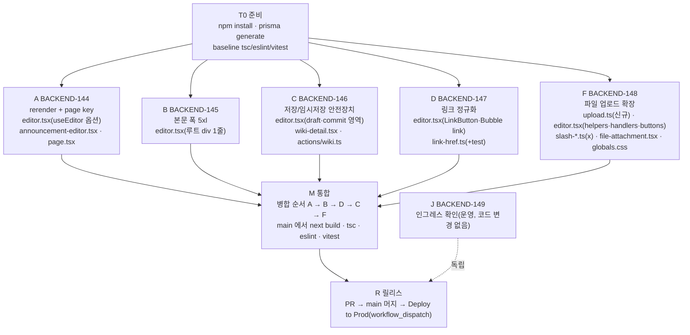

# 위키 편집 화면 사용성 개선 구현 계획

> **For agentic workers:** REQUIRED SUB-SKILL: Use superpowers:subagent-driven-development (recommended) or superpowers:executing-plans to implement this plan task-by-task. Steps use checkbox (`- [ ]`) syntax for tracking.

**Goal:** 위키 편집 화면의 확정 UI/UX 버그 5건을 고치고, 파일 첨부를 이미지와 같은 수준(드롭·붙여넣기·슬래시·다중)으로 끌어올린다.

**Architecture:** 기존 Tiptap 에디터(`src/components/wiki/editor.tsx`)와 서버 액션(`src/server/actions/wiki.ts`) 안에서 해결한다. 새 의존성·스키마 변경은 없다. 업로드 헬퍼만 `editor.tsx` 에서 `wiki/upload.ts` 로 분리해 슬래시 메뉴가 순환 import 없이 재사용한다.

**Tech Stack:** Next 16(App Router), Tiptap 3.28, Prisma, Vitest.

이 문서는 진단 결과(2026-09-25 세션)를 구현 단위로 내린 계획입니다. 수용 기준과 검증 절차는 [`docs/oracle/wiki-editor-usability.md`](../../oracle/wiki-editor-usability.md) 가 정본입니다.

---

## 티켓

| 티켓 | 작업 | 규모 |
|---|---|---|
| BACKEND-144 | A. 툴바 활성 상태 동기화 + 페이지 전환 시 편집 상태 격리 | XS |
| BACKEND-145 | B. 편집/뷰 본문 폭 통일 | XS |
| BACKEND-146 | C. 저장·임시저장 흐름 안전장치 | M |
| BACKEND-147 | D. 링크 입력 정규화 | S |
| BACKEND-148 | F. 파일 업로드 경로 확장 | M |
| BACKEND-149 | J. prod 인그레스 본문 상한 확인 | XS(운영) |

## 작업 DAG



의존 관계는 다음과 같습니다.

- A·B·C·D·F 는 서로 **데이터 의존이 없습니다**. 전부 T0 만 선행합니다. 따라서 5개를 git worktree 로 병렬 진행합니다.
- 단, 다섯 작업이 모두 `editor.tsx` 를 만집니다. 영역이 겹치지 않도록 아래 "editor.tsx 영역 배정" 을 따르고, 병합은 작은 것부터(A → B → D → C → F) 순서대로 합니다. 겹침이 생기면 통합 단계(M)에서 수동 해소합니다. 이는 실행 순서 의존이 아니라 병합 순서 규약입니다.
- F 는 업로드 헬퍼를 `editor.tsx` 밖으로 옮기므로 diff 가 가장 큽니다. 마지막에 병합해 나머지 네 작업이 rebase 를 겪지 않게 합니다.
- J 는 코드와 무관한 운영 확인이라 어느 시점에도 가능합니다. 이미 확인 완료(Traefik IngressRoute, 본문 상한 미들웨어 없음 → 변경 불필요).

### editor.tsx 영역 배정(충돌 방지)

| 작업 | 만지는 영역(현재 줄 기준) | 만지지 않을 것 |
|---|---|---|
| A | `useEditor({...})` 옵션 객체 첫 줄(231~233) | 그 외 전부 |
| B | 루트 `<div className="mx-auto max-w-3xl">`(423) 1줄 | 그 외 전부 |
| C | state 선언(219~230), `commit`/`cancel`/`revertToOriginal`/임시저장 effect/`status`(283~400), 배너 JSX(424~440) | 업로드 헬퍼·핸들러·툴바·버블 |
| D | `BubbleToolbar` 링크 모드(746~800), `LinkButton`(1400~1460) | 그 외 전부 |
| F | 업로드 헬퍼(84~190 → 삭제·이동), `editorProps.handlePaste/handleDrop`(244~280), `ImageButton`/`FileAttachButton`(1170~1260), import 블록 | draft/commit 영역·링크·툴바 버튼 순서 |

---

## T0. 준비 (main)

- [ ] `npm install` (이 체크아웃에 `node_modules` 가 없었음), `npx prisma generate`
- [ ] baseline: `npx tsc --noEmit`, `npx eslint src`, `npx vitest run` 모두 green 확인
- [ ] 통합 브랜치 `koosco/wiki-editor-usability` 를 main 에서 생성
- [ ] worktree 5개: `.worktrees/wt-{a,b,c,d,f}`, 브랜치 `koosco/wiki-editor-{a,b,c,d,f}`(통합 브랜치에서 분기), 각 worktree 에 `ln -s ../../node_modules node_modules`
- [ ] worktree 검증은 `tsc --noEmit` + `eslint` + `vitest` 만(Turbopack 이 symlink node_modules 거부, gotchas §2). `next build` 는 통합 후 main 에서 1회.

---

## Task A. 툴바 활성 상태 동기화 + 편집 상태 격리 (BACKEND-144)

**Files:**
- Modify: `src/components/wiki/editor.tsx:231-233` (`useEditor` 옵션)
- Modify: `src/components/announcements/announcement-editor.tsx:61-63`
- Modify: `src/app/(app)/wiki/[id]/page.tsx:116` (`<WikiDetail ...>` 에 `key`)

배경: Tiptap 3.x `useEditor` 는 `shouldRerenderOnTransaction` 을 주지 않으면 `null` 셀렉터로 리렌더를 건너뜁니다(`@tiptap/react@3.28.0/dist/index.js` 512행). 툴바가 `editor.isActive(...)` 를 render 중에 읽으므로 선택만 바뀌면 갱신되지 않습니다.

- [ ] **Step 1: `useEditor` 에 옵션 추가 (위키)**

```ts
const editor = useEditor({
  immediatelyRender: false,
  // Tiptap 3.x 기본값은 트랜잭션에 리렌더하지 않는다(useEditor 셀렉터가 null 반환).
  // 툴바·버블이 render 중 editor.isActive() 를 읽으므로 선택 변경마다 리렌더가 필요하다.
  shouldRerenderOnTransaction: true,
  extensions: [
```

- [ ] **Step 2: 공지 에디터도 동일 옵션** (`announcement-editor.tsx` 의 `useEditor` 첫 줄 뒤)

- [ ] **Step 3: `page.tsx` 에 `key={page.id}`**

```tsx
<WikiDetail
  key={page.id}
  pageId={page.id}
```

주석 한 줄: `// 페이지 간 이동 시 mode 등 클라이언트 state 가 남지 않도록 페이지별로 리마운트.`

- [ ] **Step 4: 검증** `npx tsc --noEmit && npx eslint src/components/wiki/editor.tsx src/components/announcements/announcement-editor.tsx "src/app/(app)/wiki/[id]/page.tsx"`
- [ ] **Step 5: 커밋** `fix(wiki): 툴바 활성 상태가 선택 변경에 갱신되지 않던 문제 + 페이지 전환 시 편집 상태 격리 (BACKEND-144)`

---

## Task B. 편집/뷰 본문 폭 통일 (BACKEND-145)

**Files:**
- Modify: `src/components/wiki/editor.tsx:423` (`<div className="mx-auto max-w-3xl">` → `max-w-5xl`)

읽기 뷰(`wiki-comments-view.tsx:378`)·헤더(`wiki-detail.tsx`)·하단 댓글 섹션이 모두 `max-w-5xl` 입니다. 댓글 거터(296px)가 5xl 컨테이너 기준으로 절대배치되므로 뷰를 3xl 로 줄이면 거터와 본문이 겹칩니다. 따라서 에디터를 5xl 로 맞춥니다.

- [ ] **Step 1: 클래스 변경** `mx-auto max-w-3xl` → `mx-auto max-w-5xl`, 주석: `// 읽기 뷰·헤더·하단 댓글과 같은 폭(5xl). 편집 진입 시 본문 리플로우 방지.`
- [ ] **Step 2: 툴바 sticky 오프셋 확인** `Toolbar` 의 `sticky top-14` 는 `WikiDetail` 헤더(py-2 + h-8 버튼 + border ≈ 49px)보다 큽니다. 이번엔 값을 바꾸지 않습니다(실측 없이 추정값을 넣지 않기, 오라클 O-B-2 에 수동 확인 항목으로 남김).
- [ ] **Step 3: 검증** `npx tsc --noEmit && npx eslint src/components/wiki/editor.tsx`
- [ ] **Step 4: 커밋** `fix(wiki): 편집 모드 본문 폭을 읽기 뷰와 같은 5xl 로 통일 (BACKEND-145)`

---

## Task C. 저장·임시저장 흐름 안전장치 (BACKEND-146)

**Files:**
- Modify: `src/server/actions/wiki.ts:88-96` (`updateWikiContent` 시그니처)
- Modify: `src/components/wiki/editor.tsx` state·commit·cancel·revert·임시저장 effect·배너
- Modify: `src/components/wiki/wiki-detail.tsx` (`updatedAt` 전달, 상태 텍스트 모바일 노출)
- Reuse: `src/components/confirm-delete.tsx` (`ConfirmDelete` controlled 모드)

### C-1. 충돌 감지 (서버)

- [ ] **Step 1: `updateWikiContent` 에 `expectedUpdatedAt?: string` 추가**

```ts
export async function updateWikiContent(
  id: string,
  title: string,
  content: unknown,
  /** 클라이언트가 마지막으로 관측한 updatedAt(ISO). 주면 낙관적 충돌 검사(saveWikiCommentAnchors 와 동일). */
  expectedUpdatedAt?: string,
): Promise<{ id: string } | { conflict: true }> {
  const user = await requireUser();
  if (expectedUpdatedAt) {
    const current = await prisma.wikiPage.findUnique({
      where: { id },
      select: { updatedAt: true },
    });
    if (
      current &&
      current.updatedAt.getTime() !== new Date(expectedUpdatedAt).getTime()
    ) {
      return { conflict: true };
    }
  }
  return updateWikiContentCore(user, id, title, content);
}
```

MCP 라우트는 `updateWikiContentCore` 를 직접 쓰므로 영향 없음. 반환 타입이 유니온이 되므로 `updateWikiContent` 호출처를 grep 해 `.id` 를 읽는 곳이 있으면 분기 처리.

### C-2. 클라이언트 (editor.tsx)

- [ ] **Step 2: props 추가** `WikiEditorProps` 에 `updatedAt: string`. `wiki-detail.tsx` 에서 `updatedAt={updatedAt}` 전달(이미 prop 으로 받고 있음).

- [ ] **Step 3: 배너 조건 분리**

`usingDraft` 는 "지금 임시저장본이 서버에 있음" 과 "진입 시 임시저장본을 불러왔음" 두 뜻으로 쓰이고 있습니다. 배너는 후자만 봐야 합니다.

```ts
const startedFromDraft = !!draft;
// 배너는 '진입 시 불러온' 임시저장본에만. 이번 세션의 자동 임시저장으로는 켜지 않는다.
const [showDraftBanner, setShowDraftBanner] = useState(startedFromDraft);
const [usingDraft, setUsingDraft] = useState(startedFromDraft);
```

임시저장 effect 의 `setUsingDraft(true)` 는 유지(상태 텍스트 "임시저장됨" 용). 배너 JSX 조건을 `showDraftBanner` 로. `revertToOriginal` 에서 `setShowDraftBanner(false)`.

- [ ] **Step 4: 임시저장 세대 카운터**

```ts
// 커밋 이후 도착한 임시저장 응답이 draft 를 되살리지 않도록, 커밋마다 세대를 올리고
// 임시저장은 자기 세대가 현재와 같을 때만 성공으로 처리한다. 요청 자체는 취소할 수
// 없으므로(서버 upsert 는 이미 실행) 커밋 직후 discardWikiDraft 로 한 번 더 지운다.
const draftGenRef = useRef(0);
```

임시저장 effect:

```ts
const gen = draftGenRef.current;
try {
  await saveWikiDraft(pageId, title, content);
  if (gen !== draftGenRef.current) {
    // 커밋이 먼저 끝났다 — 방금 만든 draft 는 유령. 정리.
    await discardWikiDraft(pageId).catch(() => {});
    return;
  }
  dirtyRef.current = false;
  setDirty(false);
  setUsingDraft(true);
} catch {
  toast.error("임시저장에 실패했습니다. 저장 버튼으로 직접 저장해 주세요.", { id: "wiki-draft-fail" });
}
```

`commit` 성공 직후: `draftGenRef.current += 1;`. `toast(..., { id })` 로 반복 토스트 1회 고정.

- [ ] **Step 5: `commit` 충돌 처리 + 새로고침 대기**

```ts
const [isRefreshing, startRefresh] = useTransition();
...
const result = await updateWikiContent(pageId, title, content, updatedAt);
if ("conflict" in result) {
  toast.error(
    "다른 사용자가 먼저 저장했습니다. 페이지를 새로고침한 뒤 다시 편집해 주세요. 지금 편집 내용은 임시저장본에 남아 있습니다.",
  );
  return; // draft 유지, 편집 모드 유지
}
draftGenRef.current += 1;
dirtyRef.current = false;
setDirty(false);
// 새 본문이 서버에서 내려올 때까지 편집 모드를 유지해 이전 본문이 잠깐 보이는 깜빡임을 막는다.
startRefresh(() => {
  router.refresh();
  onExit?.();
});
```

`saving` 상태 텍스트/버튼 비활성에 `isRefreshing` 도 포함(`saving || isRefreshing`). 충돌 시 임시저장본이 이미 서버에 있으므로 `dirtyRef` 를 건드리지 않습니다.

- [ ] **Step 6: 취소·원본으로 확인**

`ConfirmDelete` 를 controlled 로 재사용(제목/설명만 바꿈). `cancel` 은 `dirtyRef.current || usingDraft` 일 때만 다이얼로그를 열고, 아니면 즉시 종료. `revertToOriginal` 은 항상 확인.

```tsx
<ConfirmDelete
  open={confirm !== null}
  onOpenChange={(o) => !o && setConfirm(null)}
  title={confirm === "cancel" ? "편집을 취소할까요?" : "원본으로 되돌릴까요?"}
  description="저장하지 않은 변경 내용과 임시저장본이 사라집니다."
  confirmLabel="버리기"
  onConfirm={async () => { confirm === "cancel" ? await doCancel() : await doRevert(); }}
/>
```

`ConfirmDelete` 에 `confirmLabel` prop 이 없으면 추가(기본 "삭제"). `WikiEditorHandle.cancel` 은 확인 다이얼로그를 여는 함수로 유지(헤더 버튼 동작 불변).

- [ ] **Step 7: 모바일 상태 텍스트** `wiki-detail.tsx` 상태 `<span className="text-muted-foreground hidden text-xs sm:inline">` → `hidden` 과 `sm:inline` 제거, `truncate max-w-24` 로 좁은 폭 대응.

- [ ] **Step 8: 검증** `npx tsc --noEmit && npx eslint src/components/wiki src/server/actions/wiki.ts && npx vitest run`
- [ ] **Step 9: 커밋** `fix(wiki): 저장·임시저장 흐름 안전장치 — 배너 조건·경합·취소 확인·충돌 감지·저장 후 깜빡임·모바일 상태 (BACKEND-146)`

---

## Task D. 링크 입력 정규화 (BACKEND-147)

**Files:**
- Create: `src/components/wiki/link-href.ts` (순수)
- Create: `src/components/wiki/link-href.test.ts`
- Modify: `src/components/wiki/editor.tsx` `BubbleToolbar` 링크 모드(746~800), `LinkButton`(1400~1460)

- [ ] **Step 1: 실패하는 테스트**

```ts
import { describe, it, expect } from "vitest";
import { normalizeHref } from "./link-href";

describe("normalizeHref", () => {
  it("스킴 없는 도메인엔 https:// 를 붙인다", () => {
    expect(normalizeHref("example.com")).toBe("https://example.com");
    expect(normalizeHref(" example.com/path?q=1 ")).toBe("https://example.com/path?q=1");
  });
  it("이미 스킴이 있으면 그대로", () => {
    expect(normalizeHref("http://a.b")).toBe("http://a.b");
    expect(normalizeHref("https://a.b")).toBe("https://a.b");
    expect(normalizeHref("mailto:x@y.z")).toBe("mailto:x@y.z");
    expect(normalizeHref("tel:+8210")).toBe("tel:+8210");
  });
  it("앵커·상대경로·프로토콜 상대는 그대로", () => {
    expect(normalizeHref("#section")).toBe("#section");
    expect(normalizeHref("/wiki/abc")).toBe("/wiki/abc");
    expect(normalizeHref("//cdn.example.com/x")).toBe("//cdn.example.com/x");
  });
  it("빈 값과 위험 스킴은 null", () => {
    expect(normalizeHref("")).toBeNull();
    expect(normalizeHref("   ")).toBeNull();
    expect(normalizeHref("javascript:alert(1)")).toBeNull();
    expect(normalizeHref("JavaScript:alert(1)")).toBeNull();
    expect(normalizeHref("data:text/html,hi")).toBeNull();
    expect(normalizeHref("vbscript:x")).toBeNull();
  });
});
```

- [ ] **Step 2: 실패 확인** `npx vitest run src/components/wiki/link-href.test.ts` → import 실패
- [ ] **Step 3: 구현**

```ts
/**
 * 사용자가 입력한 링크 문자열을 href 로 정규화한다.
 * - 스킴이 없으면(example.com) https:// 를 붙인다.
 * - 앵커(#)·절대/상대 경로(/)·프로토콜 상대(//)·mailto:/tel: 등 스킴 있는 값은 그대로.
 * - 빈 값, javascript:/data:/vbscript: 는 null(링크 미적용).
 */
const DANGEROUS = /^(javascript|data|vbscript):/i;
const HAS_SCHEME = /^[a-z][a-z0-9+.-]*:/i;

export function normalizeHref(raw: string): string | null {
  const v = raw.trim();
  if (!v) return null;
  if (DANGEROUS.test(v)) return null;
  if (v.startsWith("#") || v.startsWith("/")) return v;
  if (HAS_SCHEME.test(v)) return v;
  return `https://${v}`;
}
```

- [ ] **Step 4: 통과 확인**
- [ ] **Step 5: 에디터 적용** 두 곳의 `applyLink`/`apply`:

```ts
const href = normalizeHref(url);
if (href === null) {
  editor.chain().focus().extendMarkRange("link").unsetLink().run();
} else {
  editor.chain().focus().extendMarkRange("link").setLink({ href }).run();
}
```

두 `<Input type="url" …>` → `type="text"`, `inputMode="url"`, `autoCapitalize="off"`, `spellCheck={false}`. 버블 링크 모드 `<Input>` 에 `onKeyDown={(e) => { if (e.key === "Escape") { e.preventDefault(); setMode("menu"); } }}`.

- [ ] **Step 6: 검증** `npx tsc --noEmit && npx eslint src/components/wiki && npx vitest run`
- [ ] **Step 7: 커밋** `fix(wiki): 링크 입력을 스킴 없이도 받도록 정규화 + 버블 링크 Esc 닫기 (BACKEND-147)`

---

## Task F. 파일 업로드 경로 확장 (BACKEND-148)

**Files:**
- Create: `src/components/wiki/upload.ts` (editor.tsx 84~190 의 `uploadImage`/`uploadFile`/`imageFilesFrom`/`htmlHasText`/`uploadAndInsertImages` 이동 + `uploadAndInsertFiles`/`pickFiles`/`splitFiles` 신규)
- Create: `src/components/wiki/upload.test.ts` (`splitFiles` 순수 테스트)
- Modify: `src/components/wiki/editor.tsx` import·`handlePaste`/`handleDrop`·`ImageButton`/`FileAttachButton`
- Modify: `src/components/wiki/upload-placeholder.ts` (위젯 문구 인자화)
- Modify: `src/components/wiki/slash-commands.ts` (`image`/`file` 메타), `slash-menu.tsx` (아이콘·run)
- Modify: `src/components/wiki/file-attachment.tsx` (편집 모드 클릭 차단)
- Modify: `src/app/globals.css` (`.wiki-file-block.ProseMirror-selectednode`, `.wiki-image-uploading` 문구 무관)

- [ ] **Step 1: `splitFiles` 테스트(순수)**

```ts
import { describe, it, expect } from "vitest";
import { splitFiles } from "./upload";

function f(name: string, type: string) {
  return { name, type } as File;
}
describe("splitFiles", () => {
  it("이미지와 그 외 파일을 나눈다", () => {
    const { images, others } = splitFiles([f("a.png", "image/png"), f("b.pdf", "application/pdf"), f("c.svg", "image/svg+xml")]);
    expect(images.map((x) => x.name)).toEqual(["a.png"]);
    expect(others.map((x) => x.name)).toEqual(["b.pdf", "c.svg"]);
  });
  it("빈 입력", () => {
    expect(splitFiles(null)).toEqual({ images: [], others: [] });
  });
});
```

SVG 는 이미지 업로드 라우트가 거부하므로(XSS) 첨부파일 쪽으로 보냅니다(파일 라우트는 `image/svg+xml` 을 차단하므로 서버가 415 를 돌려주고 토스트가 뜸 — 의도된 동작, 오라클 O-F-6).

- [ ] **Step 2: `upload.ts` 작성** — 기존 함수는 editor.tsx 에서 그대로 옮기고(동작 변경 없음) 다음을 추가:

```ts
/** 이미지 업로드 허용 타입(서버 /api/wiki/upload 와 동일). 그 외는 첨부파일로. */
const IMAGE_TYPES = new Set(["image/png", "image/jpeg", "image/gif", "image/webp"]);

export function splitFiles(files: FileList | File[] | null | undefined) {
  const all = Array.from(files ?? []);
  return {
    images: all.filter((f) => IMAGE_TYPES.has(f.type)),
    others: all.filter((f) => !IMAGE_TYPES.has(f.type)),
  };
}

/** 파일 선택 다이얼로그를 열고 선택 결과를 돌려준다(취소 시 빈 배열). 툴바·슬래시가 공유. */
export function pickFiles(opts: { accept?: string; multiple?: boolean } = {}): Promise<File[]> {
  return new Promise((resolve) => {
    const input = document.createElement("input");
    input.type = "file";
    if (opts.accept) input.accept = opts.accept;
    input.multiple = !!opts.multiple;
    input.onchange = () => resolve(Array.from(input.files ?? []));
    // 취소는 change 가 안 오므로 포커스 복귀 시 빈 배열로 정리(한 번만).
    window.addEventListener("focus", () => setTimeout(() => resolve([]), 300), { once: true });
    input.click();
  });
}

/** 임의 파일들을 병렬 업로드하고 성공분만 fileAttachment 노드로 삽입(이미지 헬퍼와 동형). */
export async function uploadAndInsertFiles(editor: Editor | null, files: File[], dropPos?: number) {
  if (!editor || editor.isDestroyed || files.length === 0) return;
  const id = {};
  if (dropPos == null) editor.chain().focus().deleteSelection().run();
  addUploadPlaceholder(editor.view, id, dropPos ?? editor.state.selection.from, "파일 업로드 중…");
  try {
    const metas = (await Promise.all(files.map(uploadFile))).filter((m): m is UploadedFile => m !== null);
    if (editor.isDestroyed || metas.length === 0) return;
    const pos = findUploadPlaceholder(editor.state, id);
    if (pos == null) return;
    const nodes = metas.map((m) => ({
      type: "fileAttachment",
      attrs: { id: m.id, name: m.name, size: m.size, mime: m.mimeType },
    }));
    editor.chain().insertContentAt(pos, nodes).run();
  } finally {
    if (!editor.isDestroyed) removeUploadPlaceholder(editor.view, id);
  }
}

/** 드롭·붙여넣기·슬래시 공용: 이미지는 이미지로, 나머지는 첨부로. */
export async function uploadAndInsertAny(editor: Editor | null, files: File[], dropPos?: number) {
  const { images, others } = splitFiles(files);
  await Promise.all([
    uploadAndInsertImages(editor, images, dropPos),
    uploadAndInsertFiles(editor, others, dropPos),
  ]);
}
```

`pickFiles` 의 취소 감지는 휴리스틱(포커스 복귀 후 300ms 에 change 가 없으면 취소로 간주). 실제 선택이 300ms 이후에 change 를 발화해도 `resolve` 는 첫 호출만 유효하므로 두 번째는 무시된다 — 이 경우 선택이 유실됨. 파일 다이얼로그는 OS 모달이라 change 가 focus 보다 먼저 오는 것이 일반적이지만 보장은 없다. `ponytail:` 주석으로 남긴다(`input.oncancel`(Chrome 113+/Safari 16.4+) 로 대체 가능 — 지원 브라우저가 확정되면 교체).

- [ ] **Step 3: `upload-placeholder.ts` 문구 인자화** `addUploadPlaceholder(view, id, pos, label = "이미지 업로드 중…")`, 위젯 spec 에 `label` 저장 → `placeholderWidget(label)`. `Decoration.widget(pos, () => placeholderWidget(label), { id })`. 기존 테스트(`upload-placeholder.test.ts`) green 유지.

- [ ] **Step 4: editor.tsx 교체**
  - 84~190 삭제, `import { uploadAndInsertImages, uploadAndInsertAny, pickFiles, splitFiles, htmlHasText } from "@/components/wiki/upload"`.
  - `handlePaste`: `const files = Array.from(event.clipboardData?.files ?? []); if (!files.length) return false; if (htmlHasText(html)) return false; void uploadAndInsertAny(editorRef.current, files); return true;`
  - `handleDrop`: 동일하게 `uploadAndInsertAny(..., pos)`. **이미지가 아니어도 `true` 를 반환**해 브라우저 기본(파일 열기·페이지 이탈)을 막는다.
  - `ImageButton.onPick` → `const files = await pickFiles({ accept: "image/png,image/jpeg,image/gif,image/webp", multiple: true }); await uploadAndInsertImages(editor, files);` (숨은 `<input>` 제거)
  - `FileAttachButton` → `const files = await pickFiles({ multiple: true }); await uploadAndInsertAny(editor, files);`

- [ ] **Step 5: 슬래시** `slash-commands.ts` 에 두 항목 추가:

```ts
{ key: "image", title: "이미지", subtitle: "이미지 파일 첨부", aliases: ["image", "img", "이미지", "사진"] },
{ key: "file", title: "파일", subtitle: "파일 첨부(다운로드 칩)", aliases: ["file", "attach", "파일", "첨부"] },
```

`slash-menu.tsx` `ICONS` 에 `image: ImageIcon, file: Paperclip`, `runFor` 에:

```ts
case "image":
  chain.run();
  void pickFiles({ accept: "image/png,image/jpeg,image/gif,image/webp", multiple: true }).then((fs) => uploadAndInsertImages(editor, fs));
  return;
case "file":
  chain.run();
  void pickFiles({ multiple: true }).then((fs) => uploadAndInsertAny(editor, fs));
  return;
```

`slash-commands.test.ts` 가 항목 수를 고정하고 있으면 갱신.

- [ ] **Step 6: 파일 칩** `file-attachment.tsx` `FileChip` 의 `<a>` 에 `onClick={(e) => { if (editor.isEditable) e.preventDefault(); }}` (NodeViewProps 의 `editor` 사용). `globals.css` `.ProseMirror-selectednode` 목록에 `.tiptap .wiki-file-block.ProseMirror-selectednode > a { outline: 2px solid color-mix(in oklch, var(--link) 40%, transparent); }` 추가.

- [ ] **Step 7: 검증** `npx tsc --noEmit && npx eslint src/components/wiki src/app/globals.css && npx vitest run`
- [ ] **Step 8: 커밋** `feat(wiki): 파일 첨부를 드롭·붙여넣기·슬래시·다중 선택으로 확장, 비이미지 드롭 시 페이지 이탈 차단 (BACKEND-148)`

---

## Task J. prod 인그레스 본문 상한 확인 (BACKEND-149)

- [x] `Team-Neki-GitOps/overlays/prod/sprint-ingressroute-https.yaml` 확인: Traefik `IngressRoute`, 미들웨어 없음. Traefik 은 buffering 미들웨어를 붙이지 않으면 요청 본문 크기를 제한하지 않는다. nginx ingress 의 1MB 기본값 우려는 해당 없음.
- [x] 결론: 변경 불필요. 티켓 DONE 처리, 오라클 O-J 에 근거 기록.

---

## M. 통합 (통합 브랜치 → main 체크아웃)

- [ ] 병합 순서 A → B → D → C → F. 충돌은 `editor.tsx` 에서만 예상. 해소 후 `npx prisma generate`(gotchas §1) 불필요(스키마 변경 없음) 이지만 `npm install` 은 신규 의존성이 없어 생략.
- [ ] 병합 산출물 NUL/비-UTF8 스캔: `git diff --stat main..HEAD | grep -i "Bin"` 결과 없음 확인(gotchas §9).
- [ ] main 체크아웃에서 `npx tsc --noEmit && npx eslint src && npx vitest run && npx next build`
- [ ] 오라클 자동 항목(O-*-auto) 전부 실행.
- [ ] `docs/work-log.md` 에 이력 1절, `docs/README.md`·`CLAUDE.md` 라우팅에 `docs/oracle/` 추가.

## R. 릴리스

- [ ] PR `koosco/wiki-editor-usability` → `main`, 본문에 오라클 수동 항목(브라우저 미검증) 명시. 머지.
- [ ] `gh workflow run deploy-prod.yml --ref main` (Deploy to Prod 는 `workflow_dispatch` 전용).
- [ ] 배포 후 오라클 O-R(헬스·배포 확인) 실행. 스키마 변경이 없으므로 initContainer `migrate deploy` 는 no-op.
- [ ] 티켓 144~148 DONE.
